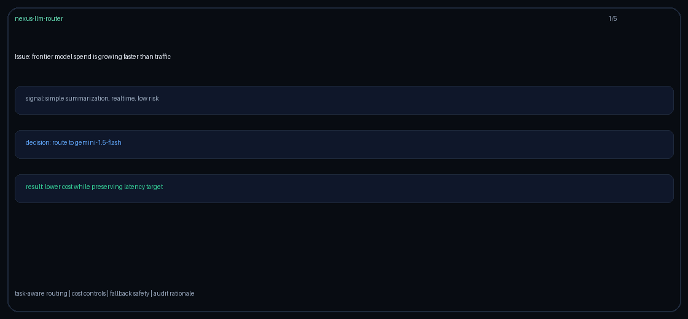
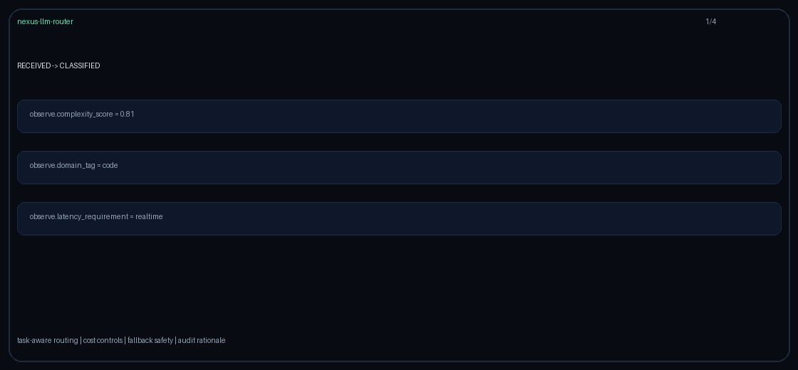

# nexus-llm-router

  
  

> Intelligent multi-LLM routing middleware with task-aware model selection, cost optimization, fallback safety, and a drop-in OpenAI-compatible API.



## Why Nexus

Most teams start with one LLM endpoint. That works until traffic grows, latency starts swinging, finance asks why every request hits the most expensive model, and incident review asks why the app kept calling a degraded provider. Nexus gives the application one stable OpenAI-compatible API while moving model choice, fallback, budget, audit, and routing rationale into infra-owned middleware.

Nexus is designed for AI infrastructure engineers running multi-model production pipelines where quality, latency, and cost must be optimized at the same time.

## Problems It Solves

- Issue: every prompt is sent to the same frontier model.
  Nexus solves this by classifying prompt complexity and routing simple tasks to cheaper low-latency models while reserving premium models for hard prompts.

- Issue: spend grows faster than product usage.
  Nexus solves this with cost-aware routing, model cost estimates, per-user budget guardrails, and Prometheus cost metrics.

- Issue: code, medical, legal, and general prompts need different quality defaults.
  Nexus solves this by extracting a domain tag and applying deterministic policy rules such as medical/legal to Claude Sonnet 4.6 and complex code to GPT-5.5.

- Issue: one provider has an incident and the app fails hard.
  Nexus solves this with per-provider circuit breakers and automatic fallback chains.

- Issue: provider latency spikes during peak traffic.
  Nexus solves this with latency-aware routing that tracks rolling p95 latency and penalizes slow providers.

- Issue: teams want to compare models without rewriting product code.
  Nexus solves this with stable request-id A/B routing selected by the `X-Router-Strategy` header.

- Issue: support and compliance teams ask why a model answered a request.
  Nexus solves this by persisting durable audit records with `request_id`, selected model, strategy, rationale, latency, token usage, and cost.

- Issue: a single API key can overwhelm the router.
  Nexus solves this with a token-bucket rate limiter keyed by API key identifier.

- Issue: session or tenant budgets need hard enforcement.
  Nexus solves this by rejecting requests before dispatch when estimated spend would exceed the configured cap.

- Issue: PII can leak into third-party providers.
  Nexus solves this with optional regex redaction and a Presidio extension path before provider dispatch.

- Issue: teams need OpenAI compatibility without giving up provider choice.
  Nexus solves this by exposing `/v1/chat/completions` while normalizing OpenAI, Anthropic, Gemini, and Moonshot adapters behind one interface.

- Issue: model routing becomes a hidden product decision.
  Nexus solves this by making routing policy explicit, testable, observable, and owned in infra.

## Demo Gallery

Terminal routing demo with JSON rationale logs:


Observe -> Decide -> Act state-machine demo:



Prompt-prefix cache affinity demo:


## Features

- **Router engine** with configurable strategies
- **Adapter pipeline** with full observability
- **Async-first** design using `asyncio` + `httpx`
- **Type-safe** with full `mypy` compliance
- **Production-ready** with Docker, CI/CD, and structured logging

## Quick Start

```bash
git clone https://github.com/Francis1998/nexus-llm-router.git
cd nexus-llm-router
pip install -e ".[dev]"
cp .env.example .env
PYTHONPATH=src uvicorn api.main:app --reload
```

## Quality Gates

```bash
ruff check src/ tests/ scripts/
mypy src/
pytest tests/ -v
```

## Docker Compose

```bash
docker compose up --build
```

Services:

- Router: `http://localhost:8000`
- Prometheus: `http://localhost:9090`
- Grafana: `http://localhost:3000`

## Routing Strategies

Select a strategy with `X-Router-Strategy`:

- `rule-based`: domain and complexity priority matrix
- `classifier`: logistic-regression-style complexity and domain features
- `cost-optimal`: minimizes estimated cost subject to quality floor
- `latency-aware`: penalizes providers with poor rolling p95 latency
- `reliability-aware`: routes to the highest-quality model whose provider circuit is closed, and orders the fallback chain healthy-providers-first
- `weighted-blend`: selects the model with the highest tunable composite of normalized quality, cost, and latency (weights via `NEXUS_BLEND_*`)
- `budget-aware`: selects the highest-quality model whose estimated per-request cost stays within a hard ceiling (`NEXUS_REQUEST_COST_CEILING_USD`); the dual of `cost-optimal`
- `sticky-session`: consistent-hashes `session_id` onto one domain-eligible model, so every turn in a session routes to the same model (context/prompt-cache affinity) while distinct sessions spread across the pool
- `value`: selects the model with the best quality-per-dollar ratio, maximizing spend efficiency with no threshold to tune
- `canary`: rolls a configurable traffic fraction (`NEXUS_CANARY_WEIGHT`) onto a canary model (`NEXUS_CANARY_MODEL`) while the rest stays on a stable model (`NEXUS_CANARY_STABLE_MODEL`); health-gated, so a canary whose provider circuit is open is paused and all traffic falls back to the stable model
- `latency-budget`: selects the highest-quality model whose provider rolling p95 latency stays within a hard SLA (`NEXUS_LATENCY_SLA_MS`); the latency-domain dual of `budget-aware`, trading quality for speed only when the SLA requires it
- `complexity-tier`: treats the classifier complexity score as a required quality target and picks the cheapest model meeting it — a catalog-adaptive quality-for-cost escalation ladder with no thresholds to tune (falls back to the top-quality model when the target is unreachable)
- `round-robin`: load-balances across every provider offering a domain-eligible model (routing each to that provider's best eligible model), spreading rate-limit pressure instead of converging on one provider; balanced by a stable `request_id` hash so routing stays deterministic and replayable
- `cascade`: routes the primary attempt to the cheapest domain-eligible model and orders the fallback chain by ascending cost, so a failure escalates one price/capability rung at a time instead of jumping to the top-quality model — minimizing expected spend on the common first-attempt-succeeds path with no thresholds to tune
- `epsilon-greedy`: with probability `NEXUS_EPSILON` explores by picking uniformly among domain-eligible models (stable second hash of `request_id`); otherwise exploits the highest-quality eligible model — a replayable bandit policy so under-prioritized catalog entries still get live traffic
- `geo-region`: prefers models whose `supported_regions` include the request region (GPT-5.5 / Claude Sonnet 4.6 / Gemini 3.x / Kimi K2 catalog priors)
- `token-budget`: selects the highest-quality domain-eligible model whose `context_window` fits `prompt_tokens_estimate + max_tokens` within the request `token_budget`; falls back to the largest-context model when nothing fits
- `slo-aware`: selects the highest-quality domain-eligible model whose provider rolling success rate meets `NEXUS_AVAILABILITY_SLO`; falls back to the highest success-rate model when nothing meets the SLO
- `semantic-cache`: on `metadata.cache_hit`, prefers the cheapest domain-eligible model; on miss, falls through to cost-optimal under the quality floor
- `prompt-prefix-cache`: hashes long shared system-prompt prefixes to sticky provider/model buckets, improving OpenRouter/LiteLLM-style KV-cache affinity for GPT-5.5, Claude Sonnet 4.6, Gemini 2.5, and Kimi K2; short prefixes fall back to cost-optimal
- `failover-priority`: walks an explicit ordered model preference list and picks the first healthy provider (LiteLLM-style ordered failover)
- `provider-health-score-blend`: blends circuit availability, rolling success rate, inverse p95 latency, model quality, and inverse estimated cost; open circuits are skipped whenever a healthy provider exists (`NEXUS_HEALTH_BLEND_*`)
- `ab`: deterministic request-id buckets across two model arms

## Documentation

| Document | Description |
|----------|-------------|
| [Architecture](ARCHITECTURE.md) | System design and component overview |
| [Configuration](CONFIGURATION.md) | All configuration options |
| [Epsilon-greedy guide](docs/guides/EPSILON_GREEDY_GUIDE.md) | Explore/exploit routing walkthrough |
| [Token-budget guide](docs/guides/TOKEN_BUDGET_GUIDE.md) | Context-window-aware quality routing |
| [Geo-region guide](docs/guides/GEO_REGION_GUIDE.md) | Region/residency-aware model selection |
| [SLO-aware guide](docs/guides/SLO_AWARE_GUIDE.md) | Availability-SLO quality routing |
| [Semantic-cache guide](docs/guides/SEMANTIC_CACHE_STRATEGY_GUIDE.md) | Cache-hit cheapest / miss cost-optimal routing |
| [Prompt-prefix-cache guide](docs/guides/PROMPT_PREFIX_CACHE_STRATEGY_GUIDE.md) | Sticky system-prompt prefix affinity for provider KV-cache hits |
| [Failover-priority guide](docs/guides/FAILOVER_PRIORITY_GUIDE.md) | Ordered healthy-provider failover |
| [Provider-health score blend guide](docs/guides/PROVIDER_HEALTH_SCORE_BLEND_GUIDE.md) | LiteLLM/Portkey-style health-aware blended routing |
| [Quickstart](QUICKSTART.md) | Local setup and first request |
| [Safety](SAFETY.md) | Guardrails, fallback, and PII controls |
| [Contributing](CONTRIBUTING.md) | Development workflow and PR process |
| [Security](SECURITY.md) | Vulnerability reporting policy |
| [Changelog](CHANGELOG.md) | Version history |

## License

Apache-2.0 © [Francis1998](https://github.com/Francis1998)

*Last updated: 2026-06-26*
