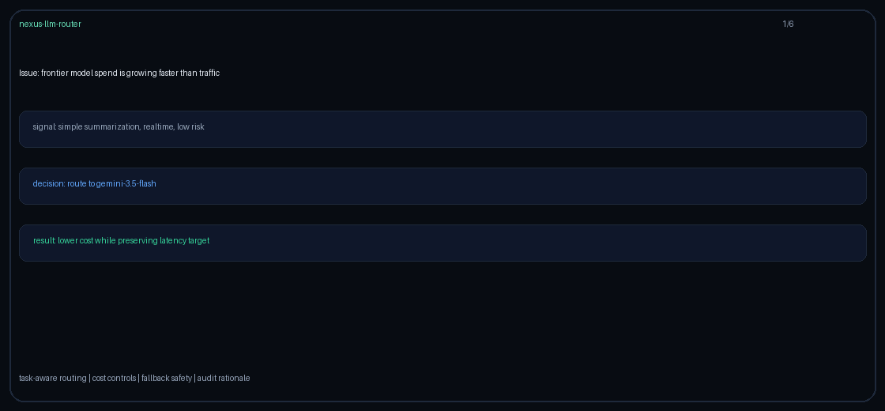
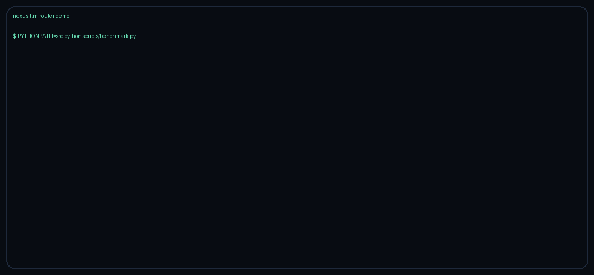
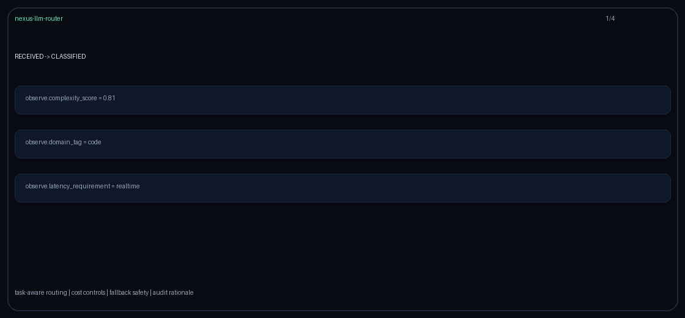
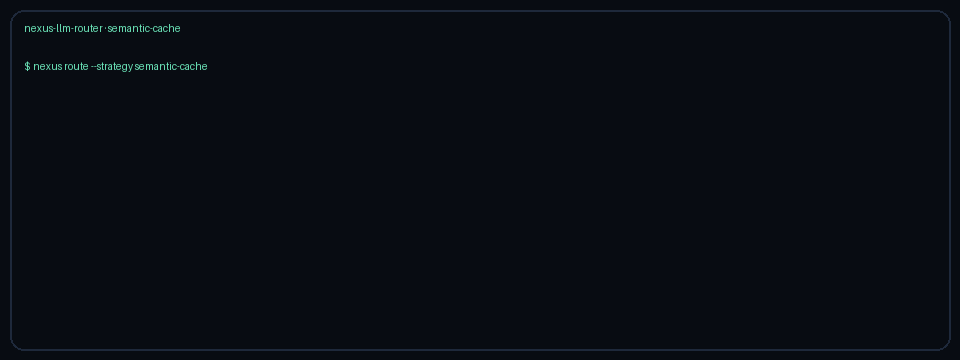
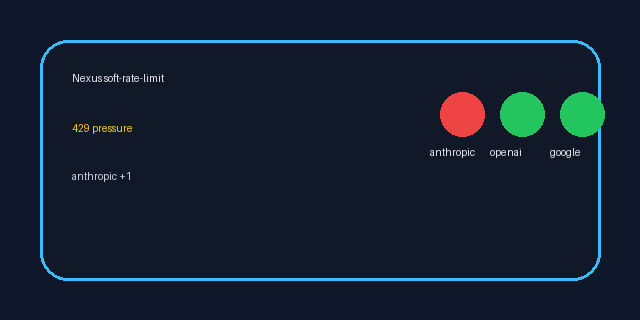

# nexus-llm-router

  


> Intelligent multi-LLM routing middleware with task-aware model selection, cost optimization, fallback safety, and a drop-in OpenAI-compatible API.



## Why Nexus

Most teams start with one LLM endpoint. That works until traffic grows, latency starts swinging, finance asks why every request hits the most expensive model, and incident review asks why the app kept calling a degraded provider. Nexus gives the application one stable OpenAI-compatible API while moving model choice, fallback, budget, audit, and routing rationale into infra-owned middleware.

Nexus is designed for AI infrastructure engineers running multi-model production pipelines where quality, latency, and cost must be optimized at the same time.

## Problems It Solves

- Issue: every prompt is sent to the same frontier model.
  Nexus solves this by classifying prompt complexity and routing simple tasks to cheaper low-latency models while reserving premium models for hard prompts.

- Issue: spend grows faster than product usage.
  Nexus solves this with cost-aware routing, model cost estimates, per-user budget guardrails, and Prometheus cost metrics.

- Issue: code, medical, legal, and general prompts need different quality defaults.
  Nexus solves this by extracting a domain tag and applying deterministic policy rules such as medical/legal to Claude Sonnet 4.6 and complex code to GPT-5.5.

- Issue: one provider has an incident and the app fails hard.
  Nexus solves this with per-provider circuit breakers and automatic fallback chains.

- Issue: provider latency spikes during peak traffic.
  Nexus solves this with latency-aware routing that tracks rolling p95 latency and penalizes slow providers.

- Issue: teams want to compare models without rewriting product code.
  Nexus solves this with stable request-id A/B routing selected by the `X-Router-Strategy` header.

- Issue: support and compliance teams ask why a model answered a request.
  Nexus solves this by persisting durable audit records with `request_id`, selected model, strategy, rationale, latency, token usage, and cost.

- Issue: a single API key can overwhelm the router.
  Nexus solves this with a token-bucket rate limiter keyed by API key identifier.

- Issue: session or tenant budgets need hard enforcement.
  Nexus solves this by rejecting requests before dispatch when estimated spend would exceed the configured cap.

- Issue: PII can leak into third-party providers.
  Nexus solves this with optional regex redaction and a Presidio extension path before provider dispatch.

- Issue: teams need OpenAI compatibility without giving up provider choice.
  Nexus solves this by exposing `/v1/chat/completions` while normalizing OpenAI, Anthropic, Gemini, and Moonshot adapters behind one interface.

- Issue: model routing becomes a hidden product decision.
  Nexus solves this by making routing policy explicit, testable, observable, and owned in infra.

## Demo Gallery

Terminal routing demo with JSON rationale logs:



Observe -> Decide -> Act state-machine demo:



Prompt-prefix cache affinity demo:



Soft rate-limit avoidance demo:



## Features

- **Router engine** with configurable strategies
- **Adapter pipeline** with full observability
- **Async-first** design using `asyncio` + `httpx`
- **Type-safe** with full `mypy` compliance
- **Production-ready** with Docker, CI/CD, and structured logging

## Quick Start

```bash
git clone https://github.com/Francis1998/nexus-llm-router.git
cd nexus-llm-router
pip install -e ".[dev]"
cp .env.example .env
PYTHONPATH=src uvicorn api.main:app --reload
```

## Quality Gates

```bash
ruff check src/ tests/ scripts/
mypy src/
pytest tests/ -v
```

## Docker Compose

```bash
docker compose up --build
```

Services:

- Router: `http://localhost:8000`
- Prometheus: `http://localhost:9090`
- Grafana: `http://localhost:3000`

## Routing Strategies

Select a strategy with `X-Router-Strategy`:

- `rule-based`: domain and complexity priority matrix
- `classifier`: logistic-regression-style complexity and domain features
- `cost-optimal`: minimizes estimated cost subject to quality floor
- `latency-aware`: penalizes providers with poor rolling p95 latency
- `reliability-aware`: routes to the highest-quality model whose provider circuit is closed, and orders the fallback chain healthy-providers-first
- `weighted-blend`: selects the model with the highest tunable composite of normalized quality, cost, and latency (weights via `NEXUS_BLEND_*`)
- `budget-aware`: selects the highest-quality model whose estimated per-request cost stays within a hard ceiling (`NEXUS_REQUEST_COST_CEILING_USD`); the dual of `cost-optimal`
- `provider-family-cost-ceiling`: selects the highest-quality domain-eligible model whose estimated cost stays within the ceiling for its provider family (`openai` / `anthropic` / `google` / `moonshot`); default via `NEXUS_PROVIDER_FAMILY_COST_CEILING_USD`, with cross-family fallback when nothing fits — OpenRouter/LiteLLM-style family budgets for GPT-5.5 / Claude Sonnet 4.6 / Gemini 3.x / Kimi K2
- `sticky-session`: consistent-hashes `session_id` onto one domain-eligible model, so every turn in a session routes to the same model (context/prompt-cache affinity) while distinct sessions spread across the pool
- `sticky-tenant-hash`: consistent-hashes `metadata.tenant_id` (then `user_id` / `sticky_key` fallbacks) onto one domain-eligible model per tenant with healthy ring failover — distinct from `sticky-session`, which pins only `session_id` for conversational affinity across GPT-5.5 / Claude Sonnet 4.6 / Gemini 3.x / Kimi K2 traffic
- `value`: selects the model with the best quality-per-dollar ratio, maximizing spend efficiency with no threshold to tune
- `canary`: rolls a configurable traffic fraction (`NEXUS_CANARY_WEIGHT`) onto a canary model (`NEXUS_CANARY_MODEL`) while the rest stays on a stable model (`NEXUS_CANARY_STABLE_MODEL`); health-gated, so a canary whose provider circuit is open is paused and all traffic falls back to the stable model
- `canary-tier-blend`: blends canary traffic with complexity-tier affinity — on the canary slice prefer the canary when it matches the inferred tier, else canary; off-slice or when unhealthy prefer tier match, else highest quality (`NEXUS_CANARY_*`)
- `shadow-traffic-mirror`: cost-optimal primary routing (`NEXUS_QUALITY_FLOOR`) with a deterministic `request_id` slice (`NEXUS_SHADOW_TRAFFIC_PERCENT`, default `5`) that annotates a shadow mirror model from a different provider for dual-run telemetry — LiteLLM/OpenRouter-style shadow comparison without changing the returned primary
- `canary-cost-blend`: blends cost exploration with healthy-provider minimization — default picks the cheapest healthy model, while `NEXUS_CANARY_COST_BLEND_PERCENT` (default `10`) explores the next-cheaper healthy tier via deterministic `request_id` hashing; distinct from `canary-tier-blend`
- `token-cost-anomaly-shed`: sheds to cheaper healthy models when the top quality pick's projected cost/1k exceeds the rolling mean times `NEXUS_TOKEN_COST_ANOMALY_RATIO` (default `2.0`); falls back to quality ranking when no cheaper healthy option exists — LiteLLM/OpenRouter-style spend spike guardrails for GPT-5.5 / Claude Sonnet 4.6 / Gemini 3.x / Kimi K2
- `multi-region-latency-hedge`: stays on highest-quality primary-region models but hedges to the lowest-p50 secondary-region candidate when the primary provider p50 exceeds `NEXUS_LATENCY_HEDGE_MS` (default `500`) — regional latency escape hatch for GPT-5.5 / Claude Sonnet 4.6 / Gemini 3.x / Kimi K2
- `adaptive-timeout-hedge`: keeps the highest-quality eligible model unless its rolling provider p95 exceeds the fastest observed eligible p95 by `NEXUS_ADAPTIVE_TIMEOUT_HEDGE_RATIO` (default `1.5`), then hedges to the fastest observed alternative for GPT-5.5 / Claude Sonnet 4.6 / Gemini 3.x / Kimi K2
- `token-bucket-tenant`: maintains independent tenant request-token buckets (`NEXUS_TOKEN_BUCKET_TENANT_RATE`, default `5`/s); in-budget requests keep quality-first routing while over-budget requests shed to the cheapest domain-eligible GPT-5.5 / Claude Sonnet 4.6 / Gemini 3.x / Kimi K2 model
- `region-carbon-blend`: blends regional carbon intensity with rolling provider p95 latency via `NEXUS_REGION_CARBON_BLEND_WEIGHT` (default `0.5`; `0` = latency only, `1` = carbon only) for GPT-5.5 / Claude Sonnet 4.6 / Gemini 3.x / Kimi K2
- `provider-weight-decay`: exponentially decays provider selection weight after failures (`NEXUS_PROVIDER_WEIGHT_DECAY_FACTOR`, default `0.5`) and recovers slowly on success (`NEXUS_PROVIDER_WEIGHT_RECOVER`, default `0.1`) for GPT-5.5 / Claude Sonnet 4.6 / Gemini 3.x / Kimi K2
- `retry-after-respect`: skips providers still inside a Retry-After cooldown (`NEXUS_RETRY_AFTER_DEFAULT_SECONDS`, default `30`) and falls back to the next healthy provider for GPT-5.5 / Claude Sonnet 4.6 / Gemini 3.x / Kimi K2
- `latency-slope-shed`: sheds the quality leader when its EWMA latency slope exceeds `NEXUS_LATENCY_SLOPE_THRESHOLD_MS` (default `25` ms/step; window via `NEXUS_LATENCY_SLOPE_WINDOW`, default `10`) to a lower-latency / cheaper healthy model for GPT-5.5 / Claude Sonnet 4.6 / Gemini 3.x / Kimi K2
- `latency-budget`: selects the highest-quality model whose provider rolling p95 latency stays within a hard SLA (`NEXUS_LATENCY_SLA_MS`); the latency-domain dual of `budget-aware`, trading quality for speed only when the SLA requires it
- `prompt-length-tier-shed`: sheds frontier-tier models when `prompt_tokens_estimate` exceeds `NEXUS_PROMPT_LENGTH_TIER_TOKENS` (default `8000`) and picks the best mid/economy alternative; short prompts keep pure quality ranking — LiteLLM/OpenRouter-style length tier shedding for GPT-5.5 / Claude Sonnet 4.6 / Gemini 3.x / Kimi K2
- `retry-budget-aware-failover`: prefers highest-quality healthy models while `metadata.retry_remaining` (or `NEXUS_RETRY_BUDGET_DEFAULT`, default `3`) is > 1, then failovers to lowest-latency healthy model on the last attempt — LiteLLM/OpenRouter-style retry-budget routing for GPT-5.5 / Claude Sonnet 4.6 / Gemini 3.x / Kimi K2
- `cache-hit-sticky-warm-pool`: consistent-hashes a long prompt prefix (min `NEXUS_CACHE_HIT_STICKY_MIN_CHARS`, default `64`) onto one domain-eligible model with healthy ring failover so provider prompt caches stay warm across GPT-5.5 / Claude Sonnet 4.6 / Gemini 3.x / Kimi K2 traffic
- `embedding-cache-key-namespace`: consistent-hashes `{NEXUS_EMBEDDING_CACHE_NAMESPACE_PREFIX}:{tenant}` (default prefix `embed`) onto one domain-eligible model with healthy ring failover so embedding/cache keys stay isolated across tenants for GPT-5.5 / Claude Sonnet 4.6 / Gemini 3.x / Kimi K2 traffic
- `carbon-aware-preference`: prefers lower carbon-intensity providers under `NEXUS_CARBON_AWARE_MAX_INTENSITY` (default `400`) for GPT-5.5 / Claude Sonnet 4.6 / Gemini 3.x / Kimi K2
- `tenant-concurrency-lease`: prefers providers with remaining per-tenant in-flight headroom (`NEXUS_TENANT_CONCURRENCY_LEASE`, default `8`) using `InflightStats` keyed by tenant/session — LiteLLM/Portkey-style tenant fairness for GPT-5.5 / Claude Sonnet 4.6 / Gemini 3.x / Kimi K2
- `provider-error-budget-shed`: prefers healthy domain-eligible providers whose rolling `SuccessStats` error rate stays under `NEXUS_PROVIDER_ERROR_BUDGET_RATE` (default `0.15`); when every provider is over budget it falls back to lowest error rate, then quality, for GPT-5.5 / Claude Sonnet 4.6 / Gemini 3.x / Kimi K2 traffic
- `region-latency-p99-shed`: prefers region-matching domain-eligible providers whose rolling `LatencyStats` p99 stays under `NEXUS_REGION_LATENCY_P99_MS` (default `3000`); when every regional provider is hot it falls back to lowest p99, then quality — LiteLLM/OpenRouter-style regional tail shedding for GPT-5.5 / Claude Sonnet 4.6 / Gemini 3.x / Kimi K2
- `sticky-canary-cost`: pins tenants via consistent hashing on `metadata.tenant_id` (with user/session fallbacks) and blends a deterministic `request_id` explore slice (`NEXUS_STICKY_CANARY_COST_PERCENT`, default `10`) toward cheaper healthy models while keeping sticky affinity off-slice — LiteLLM/Portkey-style sticky cost canaries for GPT-5.5 / Claude Sonnet 4.6 / Gemini 3.x / Kimi K2
- `queue-depth-fairness`: prefers domain-eligible providers whose live `InflightStats` queue depth stays under `NEXUS_QUEUE_DEPTH_SOFT_CAP` (default `4`); when every provider is saturated it falls back to lowest depth, then quality — LiteLLM/Portkey-style queue fairness for GPT-5.5 / Claude Sonnet 4.6 / Gemini 3.x / Kimi K2
- `provider-quota-fair-share`: tracks the last `NEXUS_PROVIDER_QUOTA_LOOKBACK` selections (default `100`) and prefers eligible providers below equal request share, shedding over-share providers while preserving quality/cost tie-breaks for GPT-5.5 / Claude Sonnet 4.6 / Gemini 3.x / Kimi K2
- `provider-spend-telemetry`: prefers lower-spend providers once soft USD spend telemetry exceeds `NEXUS_PROVIDER_SPEND_SOFT_USD` (default `10`) for GPT-5.5 / Claude Sonnet 4.6 / Gemini 3.x / Kimi K2 fleets
- `semantic-cache-ttl-affinity`: pins cacheable requests to providers with warm TTL under `NEXUS_SEMANTIC_CACHE_TTL_SECONDS` (default `300`) for GPT-5.5 / Claude Sonnet 4.6 / Gemini 3.x / Kimi K2
- `circuit-breaker-half-open-probe`: prefers healthy closed providers and allows only limited concurrent probes into half-open/recovering providers (`NEXUS_CIRCUIT_HALF_OPEN_PROBE_BUDGET`, default `2`) — LiteLLM/Portkey-style half-open probe budgeting for GPT-5.5 / Claude Sonnet 4.6 / Gemini 3.x / Kimi K2
- `latency-slo-shed`: sheds providers whose rolling p95 exceeds `NEXUS_LATENCY_SLO_MS` (default `2000`) when faster alternatives exist; prefers highest quality among under-SLO candidates and falls back to lowest latency when every provider is hot — LiteLLM/OpenRouter-style latency SLO shedding for GPT-5.5 / Claude Sonnet 4.6 / Gemini 3.x / Kimi K2
- `adaptive-timeout`: selects the highest-quality model whose risk-adjusted provider p95 fits an adaptive timeout budget derived from request urgency, recent latency, and success/error signals; prefers faster models under realtime pressure and allows slower higher-quality models when comfortable
- `complexity-tier`: treats the classifier complexity score as a required quality target and picks the cheapest model meeting it — a catalog-adaptive quality-for-cost escalation ladder with no thresholds to tune (falls back to the top-quality model when the target is unreachable)
- `round-robin`: load-balances across every provider offering a domain-eligible model (routing each to that provider's best eligible model), spreading rate-limit pressure instead of converging on one provider; balanced by a stable `request_id` hash so routing stays deterministic and replayable
- `cascade`: routes the primary attempt to the cheapest domain-eligible model and orders the fallback chain by ascending cost, so a failure escalates one price/capability rung at a time instead of jumping to the top-quality model — minimizing expected spend on the common first-attempt-succeeds path with no thresholds to tune
- `epsilon-greedy`: with probability `NEXUS_EPSILON` explores by picking uniformly among domain-eligible models (stable second hash of `request_id`); otherwise exploits the highest-quality eligible model — a replayable bandit policy so under-prioritized catalog entries still get live traffic
- `adaptive-exploration`: like `epsilon-greedy`, but epsilon decays from `NEXUS_ADAPTIVE_EXPLORATION_BASE` (default `0.2`) toward `NEXUS_ADAPTIVE_EXPLORATION_MIN` (default `0.02`) as `SuccessStats` total successes grow — explore more while cold, exploit more as GPT-5.5 / Claude Sonnet 4.6 / Gemini 3.x / Kimi K2 traffic proves out
- `geo-region`: prefers models whose `supported_regions` include the request region (GPT-5.5 / Claude Sonnet 4.6 / Gemini 3.x / Kimi K2 catalog priors)
- `region-tier-affinity`: prefers models matching both request geo region and complexity-mapped tier (frontier/mid/economy), then tier, then region, then quality — no extra `NEXUS_*` knobs
- `soft-family-budget`: deprioritizes provider families whose rolling observed spend exceeds a soft budget (`NEXUS_SOFT_FAMILY_BUDGET_USD`, window via `NEXUS_SOFT_FAMILY_BUDGET_WINDOW_SECONDS`); prefers highest-quality models from under-budget families and falls back to the cheapest other family when every family is hot — OpenRouter/LiteLLM-style family spend steering for GPT-5.5 / Claude Sonnet 4.6 / Gemini 3.x / Kimi K2
- `sticky-region-failover`: pins `session_id` to a model inside the first healthy preferred region (request `region` first, then `NEXUS_STICKY_REGION_FAILOVER_PREFERENCES`), failovers to the next region when the preferred pool is unhealthy, and keeps sticky affinity when healthy — geo-residency plus session stickiness for GPT-5.5 / Claude Sonnet 4.6 / Gemini 3.x / Kimi K2
- `region-failover-hysteresis`: like sticky-region-failover but waits for `NEXUS_REGION_FAILOVER_HYSTERESIS_SUCCESSES` (default `3`) consecutive preferred-region successes before flapping back after a failover for GPT-5.5 / Claude Sonnet 4.6 / Gemini 3.x / Kimi K2
- `token-budget`: selects the highest-quality domain-eligible model whose `context_window` fits `prompt_tokens_estimate + max_tokens` within the request `token_budget`; falls back to the largest-context model when nothing fits
- `slo-aware`: selects the highest-quality domain-eligible model whose provider rolling success rate meets `NEXUS_AVAILABILITY_SLO`; falls back to the highest success-rate model when nothing meets the SLO
- `semantic-cache`: on `metadata.cache_hit`, prefers the cheapest domain-eligible model; on miss, falls through to cost-optimal under the quality floor
- `least-busy`: selects the highest-quality domain-eligible model on the provider with the lowest current in-flight load; load ties prefer higher quality, then lower estimated cost
- `prompt-prefix-cache`: hashes long shared system-prompt prefixes to sticky provider/model buckets, improving OpenRouter/LiteLLM-style KV-cache affinity for GPT-5.5, Claude Sonnet 4.6, Gemini 2.5, and Kimi K2; short prefixes fall back to cost-optimal
- `concurrency-cap`: skips providers whose live in-flight count is at or above `NEXUS_CONCURRENCY_CAP`, then selects the highest-quality remaining model for GPT-5.5 / Claude Sonnet 4.6 / Gemini 3.x / Kimi K2 traffic
- `prompt-prefix-cache`: hashes long shared system-prompt prefixes to sticky provider/model buckets, improving OpenRouter/LiteLLM-style KV-cache affinity for GPT-5.5, Claude Sonnet 4.6, Gemini 3.x, and Kimi K2; short prefixes fall back to cost-optimal
- `soft-rate-limit`: prefers healthy providers with fewer recent 429/rate-limit observations, so GPT-5.5 / Claude Sonnet 4.6 / Gemini 3.x / Kimi K2 traffic backs away from quota pressure before hard circuit breakers trip
- `cost-latency-pareto`: keeps non-dominated cost/latency candidates (Pareto front on estimated spend and rolling provider p95), then breaks ties by quality — LiteLLM/Portkey-style multi-objective routing across GPT-5.5, Claude Sonnet 4.6, Gemini 3.x, and Kimi K2
- `token-bucket-burst`: maintains per-provider token buckets (`NEXUS_TOKEN_BUCKET_CAPACITY`, `NEXUS_TOKEN_BUCKET_REFILL_PER_SEC`) and prefers providers with burst quota for GPT-5.5 / Claude Sonnet 4.6 / Gemini 3.x / Kimi K2 traffic; when every bucket is empty it falls back to the highest remaining fraction, then cost
- `model-tier-rate-limit`: infers frontier/mid/economy tiers from model names and applies tier-specific soft RPM ceilings per provider (`NEXUS_TIER_FRONTIER_RPM`, `NEXUS_TIER_MID_RPM`, `NEXUS_TIER_ECONOMY_RPM`); prefers providers under their tier limit for GPT-5.5 / Claude Sonnet 4.6 / Gemini 3.x / Kimi K2 traffic and falls back to the least-saturated provider
- `failover-priority`: walks an explicit ordered model preference list and picks the first healthy provider (LiteLLM-style ordered failover)
- `provider-health-score-blend`: blends circuit availability, rolling success rate, inverse p95 latency, model quality, and inverse estimated cost; open circuits are skipped whenever a healthy provider exists (`NEXUS_HEALTH_BLEND_*`)
- `health-cost-latency`: ternary blend of rolling provider success rate, inverse estimated cost, and inverse p95 latency for GPT-5.5 / Claude Sonnet 4.6 / Gemini 3.x / Kimi K2 traffic (`NEXUS_HCL_*`)
- `provider-hourly-cost-ceiling`: skips providers whose rolling hourly estimated spend exceeds `NEXUS_PROVIDER_HOURLY_COST_CEILING_USD` (default `5.0`), preferring highest quality under ceiling — distinct from `provider-family-cost-ceiling` for GPT-5.5 / Claude Sonnet 4.6 / Gemini 3.x / Kimi K2
- `quality-weighted-sticky`: sticky-session hashing with hash-ring bucket weights proportional to `quality_score` (higher quality gets larger sticky share) — distinct from uniform `sticky-session` and `sticky-tenant-hash` for GPT-5.5 / Claude Sonnet 4.6 / Gemini 3.x / Kimi K2
- `token-rpm-ceiling`, `provider-circuit-probe`, `carbon-latency-blend`: tracks estimated prompt tokens per provider over a rolling 60-second window and sheds requests that would exceed `NEXUS_TOKEN_RPM_CEILING` (default `100000`) to the next eligible provider for GPT-5.5 / Claude Sonnet 4.6 / Gemini 3.x / Kimi K2
- `adaptive-concurrency-cap`: scales per-provider in-flight caps by rolling success rate and inverse p95 latency (`NEXUS_ADAPTIVE_CONCURRENCY_BASE_CAP`, `NEXUS_ADAPTIVE_CONCURRENCY_MIN_CAP`, `NEXUS_ADAPTIVE_CONCURRENCY_LATENCY_MS`) so unhealthy backends shed load while quality-first routing continues for GPT-5.5 / Claude Sonnet 4.6 / Gemini 3.x / Kimi K2
- `provider-token-fair-share`: fair-share prompt-token budget per provider in a rolling 60-second window (`NEXUS_PROVIDER_TOKEN_FAIR_SHARE_CEILING`, default `100000`) with round-robin weighted by remaining quota for GPT-5.5 / Claude Sonnet 4.6 / Gemini 3.x / Kimi K2
- `tenant-budget-cascade`: tracks per-tenant rolling spend, keeps quality-first choices while projected spend fits `NEXUS_TENANT_BUDGET_CASCADE_SOFT`, sheds to cheaper providers up to `NEXUS_TENANT_BUDGET_CASCADE_HARD`, then fails closed with a clear rationale for GPT-5.5 / Claude Sonnet 4.6 / Gemini 3.x / Kimi K2
- `provider-error-budget-reset`: temporarily sheds providers above `NEXUS_PROVIDER_ERROR_BUDGET_RESET_FRACTION` and automatically restores them after `NEXUS_PROVIDER_ERROR_BUDGET_RESET_SECONDS`, distinct from cumulative `provider-error-budget-shed`, for GPT-5.5 / Claude Sonnet 4.6 / Gemini 3.x / Kimi K2
- `sticky-region-warmup`: sends each new session's first `NEXUS_STICKY_REGION_WARMUP_REQUESTS` requests to a warmup region, then pins the session to its requested or hash-selected region to prevent cold-start flaps for GPT-5.5 / Claude Sonnet 4.6 / Gemini 3.x / Kimi K2
- `tenant-quota-burst`: keeps tenant traffic quality-first below `NEXUS_TENANT_QUOTA_BURST_SOFT`, admits a bounded rolling burst on cheaper fallbacks up to `NEXUS_TENANT_QUOTA_BURST_HARD`, then sheds before dispatch for GPT-5.5 / Claude Sonnet 4.6 / Gemini 3.x / Kimi K2
- `provider-tail-latency-hedge`: keeps the quality leader until its rolling provider p95 exceeds `NEXUS_PROVIDER_TAIL_LATENCY_HEDGE_MS`, then hedges to the fastest observed healthy provider alternative — distinct from p50 region hedging for GPT-5.5 / Claude Sonnet 4.6 / Gemini 3.x / Kimi K2
- `sticky-session-migrate`: preserves a session's model pin while its provider meets `NEXUS_STICKY_SESSION_MIGRATE_SUCCESS_THRESHOLD`, then performs one controlled migration to a healthier provider and keeps the new pin for GPT-5.5 / Claude Sonnet 4.6 / Gemini 3.x / Kimi K2
- `provider-cold-start-bias`: prefers the least-observed healthy provider until each reaches `NEXUS_PROVIDER_COLD_START_TARGET` selections inside `NEXUS_PROVIDER_COLD_START_LOOKBACK`, then returns to quality-first routing — LiteLLM/Portkey-style exploration-gap coverage for GPT-5.5 / Claude Sonnet 4.6 / Gemini 3.x / Kimi K2
- `tenant-fair-queue`: computes per-tenant request-count deficits over `NEXUS_TENANT_FAIR_QUEUE_LOOKBACK`, preserving highest-quality healthy routes for at/below-share tenants and moving above-share tenants to a cost-efficient relief lane — distinct from provider queue-depth and provider-quota fairness for GPT-5.5 / Claude Sonnet 4.6 / Gemini 3.x / Kimi K2
- `sticky-region-drain`: preserves healthy session region pins but evacuates pins listed in `NEXUS_STICKY_REGION_DRAIN_REGIONS` to the first healthy non-draining preferred region, keeping the alternate pin after the drain — Envoy/service-mesh-style operational drain for GPT-5.5 / Claude Sonnet 4.6 / Gemini 3.x / Kimi K2
- `provider-canary-shadow-split`: keeps primary traffic on `NEXUS_PROVIDER_CANARY_PRIMARY_PROVIDER` while a deterministic tenant/request slice (`NEXUS_PROVIDER_CANARY_SHADOW_PERCENT`) identifies a healthy different-provider shadow candidate and records comparison counts for GPT-5.5 / Claude Sonnet 4.6 / Gemini 3.x / Kimi K2
- `sticky-model-pin-expire`: keeps each session on a healthy model for `NEXUS_STICKY_MODEL_PIN_TTL_SECONDS`, then expires the process-local pin and re-evaluates current provider health and quality before creating a fresh pin for GPT-5.5 / Claude Sonnet 4.6 / Gemini 3.x / Kimi K2
- `tenant-priority-lanes`: maps configured or per-request tenants into high, normal, and low lanes, preserving quality when capacity is available while using fastest-healthy or cost-efficient relief routes under provider-health or lane-quota pressure for GPT-5.5 / Claude Sonnet 4.6 / Gemini 3.x / Kimi K2
- `request-class-qos`: maps `metadata.request_class` or `metadata.qos_class` to interactive (lowest observed healthy latency + quality), batch (quality-first mid-cost), or bulk (cheapest healthy) policies for GPT-5.5 / Claude Sonnet 4.6 / Gemini 3.x / Kimi K2
- `deadline-aware-pick`: reads `metadata.deadline_ms` or `metadata.remaining_ms` and picks the fastest healthy model when remaining budget is below `NEXUS_DEADLINE_AWARE_THRESHOLD_MS`, otherwise staying quality-first for GPT-5.5 / Claude Sonnet 4.6 / Gemini 3.x / Kimi K2
- `provider-success-floor`: skips providers whose rolling success rate is below `NEXUS_PROVIDER_SUCCESS_FLOOR`, preferring highest quality above the floor and emergency-retaining the highest-success provider when every candidate is below for GPT-5.5 / Claude Sonnet 4.6 / Gemini 3.x / Kimi K2
- `model-capability-gate`: filters candidates to those whose capability set covers every capability in `metadata.required_capabilities` (for example `vision`, `tools`, `long_context`), using a per-request `metadata.model_capabilities` override or the built-in known-model map, and emergency-retains the highest-quality healthy candidate when none match for GPT-5.5 / Claude Sonnet 4.6 / Gemini 3.x / Kimi K2
- `ab`: deterministic request-id buckets across two model arms

## Documentation

| Document | Description |
|----------|-------------|
| [Architecture](ARCHITECTURE.md) | System design and component overview |
| [Configuration](CONFIGURATION.md) | All configuration options |
| [Epsilon-greedy guide](docs/guides/EPSILON_GREEDY_GUIDE.md) | Explore/exploit routing walkthrough |
| [Adaptive-exploration guide](docs/guides/ADAPTIVE_EXPLORATION_GUIDE.md) | Decaying epsilon explore/exploit walkthrough |
| [Token-budget guide](docs/guides/TOKEN_BUDGET_GUIDE.md) | Context-window-aware quality routing |
| [Geo-region guide](docs/guides/GEO_REGION_GUIDE.md) | Region/residency-aware model selection |
| [Region-tier-affinity guide](docs/guides/REGION_TIER_AFFINITY_GUIDE.md) | Combined geo-region and complexity-tier affinity routing |
| [Soft-family-budget guide](docs/guides/SOFT_FAMILY_BUDGET_GUIDE.md) | Rolling soft spend budgets per provider family |
| [Sticky-region-failover guide](docs/guides/STICKY_REGION_FAILOVER_GUIDE.md) | Session stickiness with ordered region failover |
| [Region-failover-hysteresis guide](docs/guides/REGION_FAILOVER_HYSTERESIS_GUIDE.md) | Region failover with recovery hysteresis |
| [Sticky-tenant-hash guide](docs/guides/STICKY_TENANT_HASH_GUIDE.md) | Per-tenant consistent hashing with healthy failover |
| [Embedding-cache-key-namespace guide](docs/guides/EMBEDDING_CACHE_KEY_NAMESPACE_GUIDE.md) | Tenant-isolated embedding/cache sticky namespace routing |
| [Semantic-cache-ttl-affinity guide](docs/guides/SEMANTIC_CACHE_TTL_AFFINITY_GUIDE.md) | Warm semantic-cache TTL sticky routing |
| [Tenant-concurrency-lease guide](docs/guides/TENANT_CONCURRENCY_LEASE_GUIDE.md) | Per-tenant in-flight concurrency lease routing |
| [Provider-error-budget-shed guide](docs/guides/PROVIDER_ERROR_BUDGET_SHED_GUIDE.md) | Rolling provider error-budget shedding |
| [Region-latency-p99-shed guide](docs/guides/REGION_LATENCY_P99_SHED_GUIDE.md) | Regional p99 tail-latency shedding |
| [Sticky-canary-cost guide](docs/guides/STICKY_CANARY_COST_GUIDE.md) | Sticky tenant affinity with cost canary blend |
| [Queue-depth-fairness guide](docs/guides/QUEUE_DEPTH_FAIRNESS_GUIDE.md) | Soft queue-depth fairness across providers |
| [Provider-quota-fair-share guide](docs/guides/PROVIDER_QUOTA_FAIR_SHARE_GUIDE.md) | Rolling equal-share provider quota routing |
| [Provider-token-fair-share guide](docs/guides/PROVIDER_TOKEN_FAIR_SHARE_GUIDE.md) | Rolling token fair-share routing weighted by remaining quota |
| [Tenant-budget-cascade guide](docs/guides/TENANT_BUDGET_CASCADE_GUIDE.md) | Per-tenant rolling spend cascade with a hard fail-closed ceiling |
| [Circuit-breaker-half-open-probe guide](docs/guides/CIRCUIT_BREAKER_HALF_OPEN_PROBE_GUIDE.md) | Half-open recovery probe budget routing |
| [SLO-aware guide](docs/guides/SLO_AWARE_GUIDE.md) | Availability-SLO quality routing |
| [Adaptive-timeout guide](docs/guides/ADAPTIVE_TIMEOUT_GUIDE.md) | Timeout-adaptive quality routing |
| [Adaptive-timeout-hedge guide](docs/guides/ADAPTIVE_TIMEOUT_HEDGE_GUIDE.md) | Relative p95 hedge from a quality-first provider choice |
| [Token-bucket-tenant guide](docs/guides/TOKEN_BUCKET_TENANT_GUIDE.md) | Per-tenant request budget with cheapest-model shedding |
| [Region-carbon-blend guide](docs/guides/REGION_CARBON_BLEND_GUIDE.md) | Carbon intensity blended with latency scoring |
| [Provider-weight-decay guide](docs/guides/PROVIDER_WEIGHT_DECAY_GUIDE.md) | Exponential provider weight decay with slow recovery |
| [Retry-after-respect guide](docs/guides/RETRY_AFTER_RESPECT_GUIDE.md) | Honor provider Retry-After cooldowns |
| [Semantic-cache guide](docs/guides/SEMANTIC_CACHE_STRATEGY_GUIDE.md) | Cache-hit cheapest / miss cost-optimal routing |
| [Least-busy guide](docs/guides/LEAST_BUSY_GUIDE.md) | Live in-flight load-aware routing |
| [Prompt-prefix-cache guide](docs/guides/PROMPT_PREFIX_CACHE_STRATEGY_GUIDE.md) | Sticky system-prompt prefix affinity for provider KV-cache hits |
| [Concurrency-cap guide](docs/guides/CONCURRENCY_CAP_GUIDE.md) | Per-provider in-flight saturation cap routing |
| [Adaptive-concurrency-cap guide](docs/guides/ADAPTIVE_CONCURRENCY_CAP_GUIDE.md) | Health-derived dynamic in-flight cap routing |
| [Soft-rate-limit guide](docs/guides/SOFT_RATE_LIMIT_GUIDE.md) | Soft 429/rate-limit pressure avoidance |
| [Cost/latency Pareto guide](docs/guides/COST_LATENCY_PARETO_GUIDE.md) | Multi-objective non-dominated cost + latency routing |
| [Token-bucket-burst guide](docs/guides/TOKEN_BUCKET_BURST_GUIDE.md) | Bursty per-provider token-bucket quota routing |
| [Model-tier-rate-limit guide](docs/guides/MODEL_TIER_RATE_LIMIT_GUIDE.md) | Tier-specific soft RPM routing by model name |
| [Failover-priority guide](docs/guides/FAILOVER_PRIORITY_GUIDE.md) | Ordered healthy-provider failover |
| [Provider-health score blend guide](docs/guides/PROVIDER_HEALTH_SCORE_BLEND_GUIDE.md) | LiteLLM/Portkey-style health-aware blended routing |
| [Health/cost/latency guide](docs/guides/HEALTH_COST_LATENCY_GUIDE.md) | Ternary health, cost, and latency blend routing |
| [Provider-family cost-ceiling guide](docs/guides/PROVIDER_FAMILY_COST_CEILING_GUIDE.md) | Per-provider-family spend ceilings for multi-provider budgets |
| [Canary-tier-blend guide](docs/guides/CANARY_TIER_BLEND_GUIDE.md) | Canary rollout with complexity-tier affinity |
| [Latency-SLO-shed guide](docs/guides/LATENCY_SLO_SHED_GUIDE.md) | Latency SLO shedding with under-SLO quality preference |
| [Shadow-traffic-mirror guide](docs/guides/SHADOW_TRAFFIC_MIRROR_GUIDE.md) | Cost-optimal primary with shadow mirror telemetry |
| [Canary-cost-blend guide](docs/guides/CANARY_COST_BLEND_GUIDE.md) | Cost exploration with next-cheaper healthy tier sampling |
| [Token-cost-anomaly-shed guide](docs/guides/TOKEN_COST_ANOMALY_SHED_GUIDE.md) | Rolling cost/1k anomaly shedding with quality fallback |
| [Quickstart](QUICKSTART.md) | Local setup and first request |
| [Safety](SAFETY.md) | Guardrails, fallback, and PII controls |
| [Contributing](CONTRIBUTING.md) | Development workflow and PR process |
| [Security](SECURITY.md) | Vulnerability reporting policy |
| [Changelog](CHANGELOG.md) | Version history |

## License

Apache-2.0 © [Francis1998](https://github.com/Francis1998)

*Last updated: 2026-08-01*
