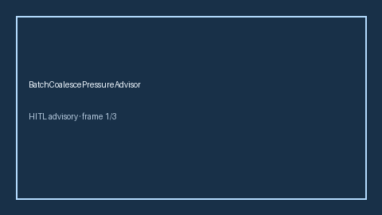

# BatchCoalescePressureAdvisor Guide



Offline HITL advisor. Never network I/O.
Gap vs vLLM/TGI/OpenAI-compatible batch-coalesce pressure monitors. Distinct from `EmbeddingBatchSkewAdvisor` and `TokenBucketBurstStrategy`.

Optional polish via **GPT-5.5 / Claude Sonnet 4.6 / Gemini 3.x / Kimi K2**.

## Usage

```python
from safety.batch_coalesce_pressure import BatchCoalescePressureAdvisor

advice = BatchCoalescePressureAdvisor().advise(request_id="r1", coalesce_pressure=0.45)
print(advice.band)
```
