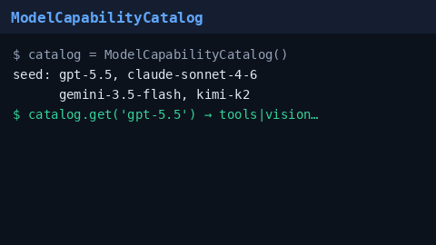

# Model Capability Catalog Guide

Refreshable, thread-safe catalog of model capability frozensets for
GPT-5.5 / Claude Sonnet 4.6 / Gemini 3.x / Kimi K2 routing. Strategies can
read a live snapshot instead of a process-frozen
`_KNOWN_MODEL_CAPABILITIES` map.



## Why

Capability-aware strategies (`model-capability-gate`, `*-prefer`, …) fall back
to a static module-level map. Shipping a new model capability historically
required a restart. `ModelCapabilityCatalog` seeds the known frontier models,
supports live `upsert`, and can `refresh_from_static()` without bouncing the
process.

## How it works

1. Construction auto-seeds `gpt-5.5`, `claude-sonnet-4-6`, `gemini-3.5-flash`,
   and `kimi-k2` (or pass a custom `seed=` / `auto_seed=False`).
2. `get(model)` returns a frozenset (or `None`).
3. `upsert(model, capabilities)` inserts or replaces an entry.
4. `refresh_from_static()` replaces the map with the built-in seed.
5. `snapshot()` returns a copy safe for strategies to hold while the shared
   catalog continues to mutate.

Pass `catalog.snapshot()` (or the catalog itself via a thin adapter) as the
`capability_map=` argument many strategies already accept.

## Example

```python
from router.capability_catalog import ModelCapabilityCatalog

catalog = ModelCapabilityCatalog()
print(catalog.get("gpt-5.5"))  # frozenset with tools, vision, ...
catalog.upsert("gpt-5.5", catalog.get("gpt-5.5") | {"mcp"})
capability_map = catalog.snapshot()
# hand capability_map to ModelCapabilityGateStrategy / prefer strategies
catalog.refresh_from_static()
```

## Gap vs LiteLLM / OpenRouter

| Capability | LiteLLM / OpenRouter | Nexus |
| --- | --- | --- |
| Static known-model map | Yes | `_KNOWN_MODEL_CAPABILITIES` |
| Live refresh without restart | Yes (provider sync) | `ModelCapabilityCatalog` |
| Thread-safe shared catalog | Yes | RLock + `snapshot()` |
| Seed frontier SKUs | Yes | GPT-5.5 / Sonnet 4.6 / Gemini 3.x / Kimi K2 |
