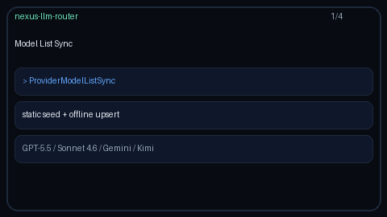

# Capability Model List Sync Guide

Offline, deterministic sync of static / provider model lists into
`ModelCapabilityCatalog` for GPT-5.5 / Claude Sonnet 4.6 / Gemini 3.x /
Kimi K2. Closes the LiteLLM `model_list` sync and Portkey model-catalog
refresh gap without live network calls.



## Why

Capability-aware routing needs an up-to-date model → capabilities map.
LiteLLM periodically syncs a configured `model_list`; Portkey refreshes a
hosted catalog. Nexus keeps the control plane offline-first:
`ProviderModelListSync` loads the built-in static seed via
`refresh_from_static`, then applies a provided list of `ModelDescriptor`
rows through `upsert`.

## How it works

1. Construct `ProviderModelListSync(catalog)` (or omit `catalog` to start empty).
2. `sync_static()` replaces the catalog with the known frontier seed.
3. `sync(descriptors, refresh_static_first=False)` upserts each descriptor.
4. With `refresh_static_first=True`, the static seed is restored before upserts
   so stale custom rows are cleared first.
5. The returned `ModelListSyncResult` reports refresh/upsert counts and the
   sorted final model ids.

No HTTP clients, API keys, or background threads are involved — tests stay
deterministic.

## Example

```python
from router.capability_catalog import ModelCapabilityCatalog
from router.model_list_sync import ModelDescriptor, ProviderModelListSync

catalog = ModelCapabilityCatalog(auto_seed=False)
syncer = ProviderModelListSync(catalog)

syncer.sync_static()  # gpt-5.5 / claude-sonnet-4-6 / gemini-3.5-flash / kimi-k2

syncer.sync(
    [
        ModelDescriptor("gpt-5.5", frozenset({"tools", "vision", "mcp"}), provider="openai"),
        ModelDescriptor("custom-eval-model", frozenset({"tools", "json"})),
    ],
    refresh_static_first=False,
)

capability_map = catalog.snapshot()
```

## Gap vs LiteLLM / Portkey

| Capability | LiteLLM / Portkey | Nexus |
| --- | --- | --- |
| Provider model-list sync | Live `model_list` / hosted catalog | Offline `ProviderModelListSync` |
| Static seed refresh | Config reload | `sync_static` → `refresh_from_static` |
| Upsert / overlay | Yes | `sync(descriptors)` → `upsert` |
| Network required in tests | Often | Never |
| Frontier SKUs | Yes | GPT-5.5 / Sonnet 4.6 / Gemini 3.x / Kimi K2 |
