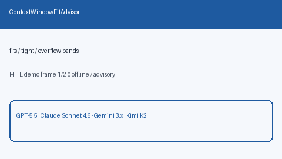

# Context Window Fit Advisor Guide

Advisory fit bands (`fits` / `tight` / `overflow`) from estimated tokens vs a
model context limit — for GPT-5.5 / Claude Sonnet 4.6 / Gemini 3.x / Kimi K2
traffic **before** dispatch.



## Why

Operators need to know whether a prompt will fit a model's context window
before spending on a call that truncates or 400s. LiteLLM and OpenRouter
expose context metadata; Nexus needs an offline advisor that never mutates
state and never rejects traffic.

## Distinct from

| Component | Role |
| --- | --- |
| `StreamingTokenBudgetGate` | Hard mid-stream token/cost cut-off |
| `RequestCostForecastAdvisor` | Pre-dispatch USD cost estimate |
| `ContextWindowFitAdvisor` | Pre-dispatch fit band + advisory only |

## How it works

1. Construct with optional `tight_ratio` (default `0.85`, exclusive of `0`/`1`).
2. Call `advise(estimated_tokens=..., model_context_limit=..., model=...)`.
3. Receive `ContextWindowFitAdvice` with `band`, `utilization`,
   `headroom_tokens`, and `advisory`.

Bands:

```text
overflow  when estimated_tokens >= model_context_limit
tight     when utilization >= tight_ratio (and not overflow)
fits      otherwise
```

## Example

```python
from safety.context_window_fit import ContextWindowFitAdvisor

advisor = ContextWindowFitAdvisor(tight_ratio=0.85)
advice = advisor.advise(
    estimated_tokens=110_000,
    model_context_limit=128_000,
    model="gpt-5.5",
)
assert advice.band == "tight"
print(advice.advisory, advice.headroom_tokens)
```

## Gap vs LiteLLM / OpenRouter

| Capability | LiteLLM / OpenRouter | Nexus |
| --- | --- | --- |
| Pre-request context fit | Hosted model metadata | `ContextWindowFitAdvisor` |
| Fit bands | Varies | Explicit `fits` / `tight` / `overflow` |
| Headroom tokens | Varies | `headroom_tokens` (negative on overflow) |
| Mutates / rejects | Sometimes | Never (advisory only) |
