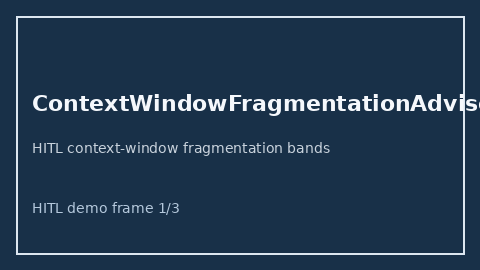

# ContextWindowFragmentationAdvisor Guide



Offline HITL advisor. Never auto-acts. Closes gaps vs OpenAI/Anthropic/Gemini context-window fragmentation advisors.

Optional later polish via **GPT-5.5 / Claude Sonnet 4.6 / Gemini 3.x / Kimi K2**.

Distinct from ``ContextWindowFitAdvisor`` and ``KvCacheEvictionPressureAdvisor``.

## Usage

```python
from safety.context_window_fragmentation import ContextWindowFragmentationAdvisor

advice = ContextWindowFragmentationAdvisor().advise(
    request_id="r1", fragmentation_ratio=0.25
)
print(advice.band)
```

## Safety

No HTTP. Humans decide. See `SAFETY.md`.
