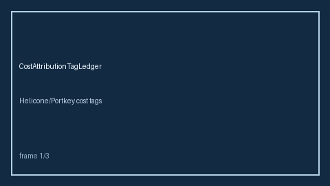

# Cost Attribution Tag Ledger Guide



Record Helicone-style cost attribution tags per request and roll up by tag.
Never performs network I/O. Closes the Helicone / Portkey / LiteLLM cost-tag gap.

Optional later polish via **GPT-5.5 / Claude Sonnet 4.6 / Gemini 3.x / Kimi K2**.

Distinct from `SpendLedgerGuard` and `TenantSpendQuotaGuard`.

## Usage

```python
from safety.cost_attribution_tag import CostAttributionTagLedger

ledger = CostAttributionTagLedger()
ledger.record("r1", tags=("team:search", "env:prod"), cost_usd=0.02)
print(ledger.rollup())
```
