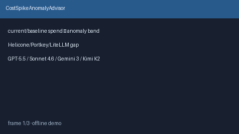

# CostSpikeAnomalyAdvisor Guide



Offline advisory cost-spike anomaly bands vs rolling baseline. Never network
I/O. Gap vs Helicone / Portkey / LiteLLM cost-anomaly routing.

Optional polish via **GPT-5.5 / Claude Sonnet 4.6 / Gemini 3.x / Kimi K2**.

Distinct from `CostForecastAdvisor` and `TenantSpendQuotaGuard`.

## Usage

```python
from safety.cost_spike_anomaly import CostSpikeAnomalyAdvisor

advice = CostSpikeAnomalyAdvisor().advise(
    tenant_id="t1",
    current_spend_usd=40.0,
    baseline_spend_usd=10.0,
)
print(advice.band, advice.spike_ratio)
```
