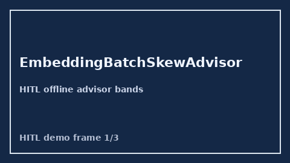

            # EmbeddingBatchSkewAdvisor Guide

            

            Closes vLLM / OpenRouter / LiteLLM embedding-batch skew gaps.

            Optional later polish via **GPT-5.5 / Claude Sonnet 4.6 / Gemini 3.x / Kimi K2**.

            Distinct from `MultimodalTokenTaxAdvisor` and `PromptCompressionRatioAdvisor`.

            ## Usage

            ```python
            from safety.embedding_batch_skew import EmbeddingBatchSkewAdvisor

advice = EmbeddingBatchSkewAdvisor().advise(request_id="r1", batch_size=16, target_size=8)
print(advice.band, advice.skew_ratio)
            ```

            ## Safety

            Advisory only. No HTTP. Humans decide routing changes.
