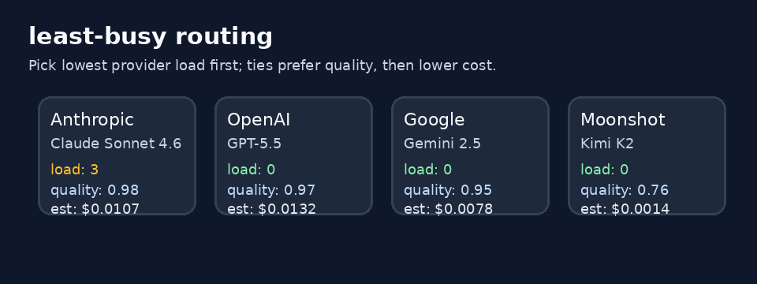

# Embedding-Cache-Key-Namespace Routing Guide



Use the `embedding-cache-key-namespace` strategy when sticky/cache routing must
**isolate tenants** so embedding or semantic-cache keys do not collide.

## When to use it

- Multiple tenants share a gateway and must not reuse each other's cache
  affinity buckets.
- You want a configurable namespace prefix
  (`NEXUS_EMBEDDING_CACHE_NAMESPACE_PREFIX`, default `embed`) prepended to the
  tenant/session sticky key.
- GPT-5.5 / Claude Sonnet 4.6 / Gemini 3.x / Kimi K2 traffic should keep
  healthy-ring failover while remaining tenant-isolated.

## How it works

1. Filter domain-eligible catalog candidates.
2. Resolve tenant scope from `metadata.tenant_id` (then `user_id` /
   `sticky_key` / `session_id`).
3. Build namespaced key `{prefix}:{scope}`.
4. Consistent-hash onto the ordered eligible catalog with healthy failover.

## Quick start

```bash
export NEXUS_DEFAULT_STRATEGY=embedding-cache-key-namespace
export NEXUS_EMBEDDING_CACHE_NAMESPACE_PREFIX=embed
```

Or per request:

```http
X-Router-Strategy: embedding-cache-key-namespace
```

## Demo

See the offline routing walkthrough in [`assets/demo.gif`](../../assets/demo.gif).

## Suggested repo metadata

- **Description:** Multi-provider LLM router with pluggable strategies, safety
  guardrails, and GPT-5.5 / Claude Sonnet 4.6 / Gemini 3.x / Kimi K2 catalog.
- **Topics:** `llm-router`, `litellm`, `openai`, `anthropic`, `gemini`, `routing`, `python`
