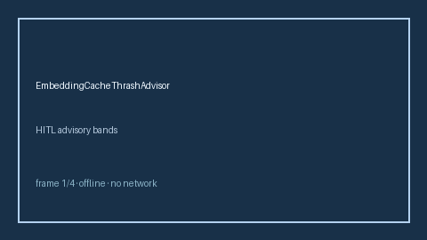

# EmbeddingCacheThrashAdvisor Guide



Offline HITL advisor. Never performs network I/O.
Closes gaps vs Redis/vLLM/embedding-cache thrash monitors.

Optional later polish via **GPT-5.5 / Claude Sonnet 4.6 / Gemini 3.x / Kimi K2**.

Distinct from `TokenizerVocabularyDriftAdvisor` and `StickySessionBleedAdvisor`.

## Usage

```python
from safety.embedding_cache_thrash import EmbeddingCacheThrashAdvisor

advice = EmbeddingCacheThrashAdvisor().advise(request_id="req-1", thrash_ratio=0.4)
print(advice.band)
```

## Safety

Advisory bands only. No HTTP. Humans decide. See `SAFETY.md`.
