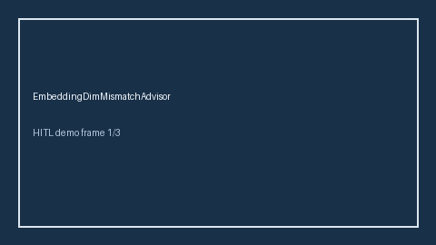

# EmbeddingDimMismatchAdvisor Guide



Offline HITL advisor. Never auto-acts. Closes gaps vs LiteLLM/OpenRouter/vLLM embedding dimension mismatch advisors.

Optional later polish via **GPT-5.5 / Claude Sonnet 4.6 / Gemini 3.x / Kimi K2**.

Distinct from ``TokenizerMismatchAdvisor`` and ``EmbeddingBatchSkewAdvisor``.

## Usage

```python
from safety.embedding_dim_mismatch import EmbeddingDimMismatchAdvisor

advice = EmbeddingDimMismatchAdvisor().advise(request_id="r1", dim_delta=2.0)
print(advice.band)
```

## Safety

No HTTP. Humans decide. See `SAFETY.md`.
