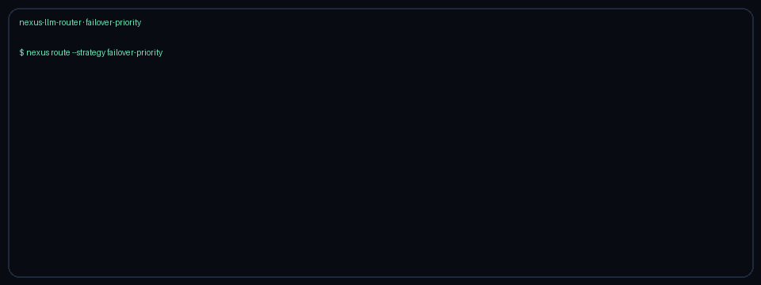

# Failover-Priority Routing Guide

Use the `failover-priority` strategy when you want LiteLLM-style ordered failover:
an explicit preference list of models, walking down until a healthy provider is
found.

## When to use it

- Operators define a hard preference order (for example GPT-5.5 → Claude Sonnet
  4.6 → Gemini 2.5 → Kimi K2) rather than optimizing for cost or quality.
- Open circuit breakers should skip a preference without changing the ordered
  intent of the remaining list.
- You need a deterministic fallback chain that preserves that same order.

## How it works

1. Resolve `NEXUS_FAILOVER_PRIORITY` to catalog models (unknown names are ignored
   as long as at least one remains).
2. Walk the list in order and pick the first model whose provider circuit is
   closed (`ProviderHealth.is_available`).
3. If every preference is unhealthy, route to the first listed catalog model so
   decide-time never hard-fails.
4. Build the fallback chain from the remaining preference order.

## Quick start

```bash
export NEXUS_DEFAULT_STRATEGY=failover-priority
export NEXUS_FAILOVER_PRIORITY='["gpt-5.5","claude-sonnet-4-6","gemini-3.1-pro-preview","kimi-k2"]'
```

Or per request:

```http
X-Router-Strategy: failover-priority
```

## Demo


