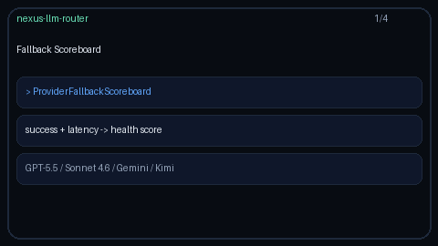

# Provider Fallback Scoreboard Guide

Per-provider health scoring for fallback ordering — track success, latency,
and error rates, then recommend a fallback preference list for GPT-5.5 /
Claude Sonnet 4.6 / Gemini 3.x / Kimi K2 traffic.



## Why

LiteLLM and OpenRouter expose provider health signals used when building
failover chains. Nexus already has circuit breakers and `SuccessStats` inside
routing strategies; `ProviderFallbackScoreboard` is the reusable library
building block that ranks providers by a composite health score so callers
(engine hooks, ops tooling, or a future strategy) can ask for a recommended
fallback order.

## How it works

1. `record_outcome(provider, success, latency_ms)` updates rolling counters.
2. Optional exponential decay (`decay_half_life_seconds`) down-weights stale
   observations using an injectable `clock` (defaults to `time.monotonic`).
3. Health score = `success_rate / (1 + avg_latency_ms / latency_ref_ms)`.
4. `rank()` / `rank(candidates)` returns providers best-first (unknown
   candidates sort last, preserving input order among ties/unknowns).
5. `snapshot(provider)` exposes success/error rates, average latency, and score.

## Example

```python
from router.fallback_scoreboard import ProviderFallbackScoreboard

board = ProviderFallbackScoreboard(decay_half_life_seconds=60.0, latency_ref_ms=1000.0)
board.record_outcome("openai", True, 120.0)
board.record_outcome("anthropic", True, 180.0)
board.record_outcome("google", False, 900.0)
board.record_outcome("moonshot", True, 250.0)

print(board.rank())
# e.g. ['openai', 'anthropic', 'moonshot', 'google']

print(board.rank(["google", "openai", "anthropic"]))
print(board.snapshot("openai"))
```

## Gap vs LiteLLM / OpenRouter

| Capability | LiteLLM / OpenRouter | Nexus |
| --- | --- | --- |
| Provider health scoring | Yes | `ProviderFallbackScoreboard` |
| Success + latency blend | Yes | Composite health score |
| Error-rate visibility | Yes | `snapshot(...).error_rate` |
| Fallback preference order | Yes | `rank()` / `rank(candidates)` |
| Injectable clock + decay | Varies | `clock=` + optional half-life |
| Frontier model traffic | Yes | GPT-5.5 / Sonnet 4.6 / Gemini 3.x / Kimi K2 |
