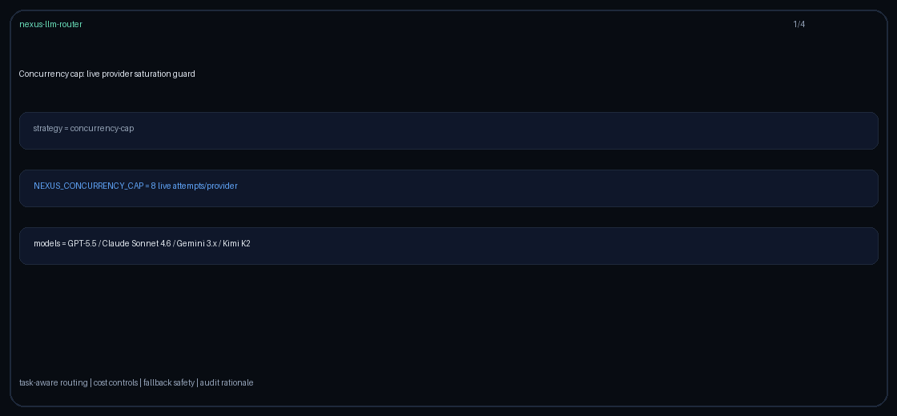

# file-search-prefer Guide

Capability-aware routing for GPT-5.5 / Claude Sonnet 4.6 / Gemini 3.x / Kimi K2.

## Why

OpenAI Assistants file_search / vector retrieval capability routing.

## Signals

Metadata keys: `requires_file_search`, `file_search`, `file-search`; allowlist `file_search_models`.
