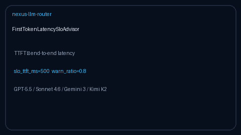

# First-Token Latency SLO Advisor Guide

Advisory time-to-first-token (TTFT) SLO bands (`within` / `warn` / `breach`)
for GPT-5.5 / Claude Sonnet 4.6 / Gemini 3.x / Kimi K2 streaming starts.



## Why

Helicone and Langfuse surface TTFT dashboards for streaming APIs, but offline
/ air-gapped Nexus gateways still need a process-local advisor that classifies
first-token latency separately from end-to-end completion time.
`FirstTokenLatencySloAdvisor` is advisory only: it never rejects traffic.

## Distinct from

| Component | Role |
| --- | --- |
| `ModelLatencySlaTracker` | Rolling **end-to-end** p50/p95 SLA breach flags |
| `latency-slo-shed` / `latency-budget` | Routing strategies that change model pick |
| `FirstTokenLatencySloAdvisor` | **TTFT / first-token** SLO bands only |

## How it works

1. Construct with `slo_ttft_ms` (default `500`), `warn_ratio` (default `0.8`),
   `window_size` (default `50`), and optional `per_model_slo_ttft_ms`.
2. `advise(model=..., ttft_ms=...)` returns a one-shot `FirstTokenSloAdvice`
   without mutating state.
3. `record(model, ttft_ms)` appends into a bounded deque and returns a rolling
   snapshot (`samples`, `p50_ttft_ms`).
4. Bands:
   - `breach` when `ttft_ms > slo_ttft_ms`
   - `warn` when `ttft_ms >= slo_ttft_ms * warn_ratio`
   - `within` otherwise
5. `breaches` / `snapshot` / `models` / `clear` support ops and tests.

## Example

```python
from safety.first_token_slo import FirstTokenLatencySloAdvisor

advisor = FirstTokenLatencySloAdvisor(
    slo_ttft_ms=400.0,
    warn_ratio=0.75,
    per_model_slo_ttft_ms={"claude-sonnet-4-6": 600.0},
)

print(advisor.advise(model="gpt-5.5", ttft_ms=180.0).band)  # within
advisor.record("gemini-3.5-flash", 450.0)
advisor.record("kimi-k2", 120.0)
for snap in advisor.breaches():
    print(snap.model, snap.ttft_ms, snap.advisory)
```

## Gap vs Helicone / Langfuse

| Capability | Helicone / Langfuse | Nexus |
| --- | --- | --- |
| TTFT dashboards | Hosted streaming UI | Process-local advisor |
| First-token SLO bands | Alert rules | `within` / `warn` / `breach` |
| Distinct from E2E latency | Yes | Separate from `ModelLatencySlaTracker` |
| Offline / air-gapped | Requires SaaS | In-memory, no network |
| Frontier model traffic | Yes | GPT-5.5 / Sonnet 4.6 / Gemini 3.x / Kimi K2 |
