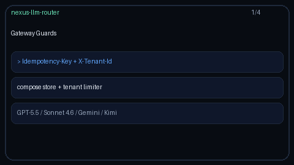

# Gateway Guards Guide

Composable ingress guards for GPT-5.5 / Claude Sonnet 4.6 / Gemini 3.x /
Kimi K2 chat completions. Wires durable `Idempotency-Key` replay together with
hard `X-Tenant-Id` rate limiting before provider dispatch.



## Why

LiteLLM and Portkey expose gateway middleware that combines idempotent retries
and per-tenant ceilings. Nexus already shipped `IdempotencyStore` and
`TenantRateLimiter` as library modules; `GatewayGuardService` composes them and
`api.main` exposes `@lru_cache` getters so `/v1/chat/completions` can apply
them lightly without breaking clients that omit the headers.

## How it works

1. `get_idempotency_store()` / `get_tenant_rate_limiter()` / `get_gateway_guards()`
   follow the same `@lru_cache` pattern as `get_response_cache` / `get_spend_ledger`.
2. When `X-Tenant-Id` is present, `assert_tenant_allowed` hard-rejects excess
   traffic with HTTP 429 (`TenantRateLimitExceededError`).
3. When `Idempotency-Key` is present, `check_idempotency` replays the stored
   JSON body on retries; after a successful completion, `remember_response`
   stores the serialized `ChatCompletionResponse`.
4. When either header is absent, behaviour matches the pre-guard API
   (fully backward compatible).

## Configuration

```bash
NEXUS_IDEMPOTENCY_PATH=migrations/idempotency.sqlite3
NEXUS_IDEMPOTENCY_TTL_SECONDS=86400
NEXUS_TENANT_RATE_LIMIT_CAPACITY=60
NEXUS_TENANT_RATE_LIMIT_REFILL_PER_SECOND=1
```

## Example

```python
from safety.gateway_guards import GatewayGuardService
from safety.idempotency import IdempotencyStore
from safety.tenant_rate_limiter import TenantRateLimiter

guards = GatewayGuardService(
    IdempotencyStore("migrations/idempotency.sqlite3"),
    TenantRateLimiter(capacity=60, refill_per_second=1.0),
)
guards.assert_tenant_allowed("acme")
existing = guards.check_idempotency("retry-1", "acme")
if existing is None:
    # dispatch GPT-5.5 / Claude Sonnet 4.6 / Gemini 3.x / Kimi K2
    guards.remember_response("retry-1", "acme", '{"id":"chatcmpl-1"}', 200)
```

Curl with both headers:

```bash
curl -X POST http://localhost:8000/v1/chat/completions \
  -H 'Content-Type: application/json' \
  -H 'Idempotency-Key: retry-1' \
  -H 'X-Tenant-Id: acme' \
  -d '{"messages":[{"role":"user","content":"hello"}],"model":"gpt-5.5"}'
```

## Gap vs LiteLLM / Portkey

| Capability | LiteLLM / Portkey | Nexus |
| --- | --- | --- |
| Composed gateway guards | Yes | `GatewayGuardService` |
| Idempotency-Key replay | Yes | `check_idempotency` / `remember_response` |
| Hard per-tenant rate limit | Yes | `assert_tenant_allowed` via `X-Tenant-Id` |
| Optional headers (compat) | Yes | No-op when headers absent |
| FastAPI wiring | Middleware | `@lru_cache` getters + light endpoint hooks |
