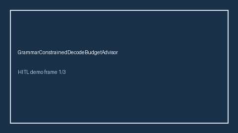

# GrammarConstrainedDecodeBudgetAdvisor Guide



Offline HITL advisor. Never auto-acts. Closes gaps vs vLLM/Outlines/XGrammar grammar-constrained decode budget advisors.

Optional later polish via **GPT-5.5 / Claude Sonnet 4.6 / Gemini 3.x / Kimi K2**.

Distinct from ``StructuredOutputRepairAdvisor`` and ``OutputTokenCeilingGuard``.

## Usage

```python
from safety.grammar_constrained_decode_budget import GrammarConstrainedDecodeBudgetAdvisor

advice = GrammarConstrainedDecodeBudgetAdvisor().advise(request_id="r1", constraint_tokens=400.0)
print(advice.band)
```

## Safety

No HTTP. Humans decide. See `SAFETY.md`.
