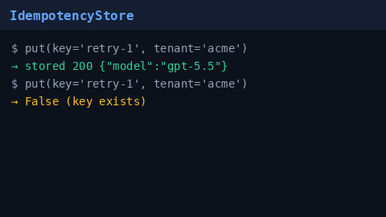

# Idempotency Store Guide

Durable `Idempotency-Key` storage for GPT-5.5 / Claude Sonnet 4.6 /
Gemini 3.x / Kimi K2 chat completions. Safe client retries replay the original
response instead of double-dispatching (and double-billing) the provider.



## Why

Gateways that accept `Idempotency-Key` must remember the first successful
response for a `(key, tenant)` pair. LiteLLM and Portkey ship durable
idempotency stores; Nexus now provides the same building block via
`safety.idempotency.IdempotencyStore` (SQLite-backed, TTL eviction).

## How it works

1. `put(key, tenant, response_json, status_code)` stores the response when the
   key is new and returns `True`. A duplicate unexpired key returns `False`
   without overwriting.
2. `get(key, tenant)` returns an `IdempotencyRecord` (or `None` on miss /
   expiry) so middleware can replay `status_code` + `response_json`.
3. Expired rows are evicted on `put` / `get` and via `evict_expired()`.
4. Use `":memory:"` in unit tests (persistent connection, like
   `VirtualKeyStore`). Prefer a filesystem path in production.

Wire the store in front of `/v1/chat/completions` when clients send an
`Idempotency-Key` header. Module + tests are sufficient for v1; deep API
rewiring is optional.

## Configuration

```bash
NEXUS_IDEMPOTENCY_PATH=migrations/idempotency.sqlite3
NEXUS_IDEMPOTENCY_TTL_SECONDS=86400
```

## Example

```python
from safety.idempotency import IdempotencyStore

store = IdempotencyStore("migrations/idempotency.sqlite3", ttl_seconds=86400)
if store.put("retry-1", "acme", '{"id":"chatcmpl-1","model":"gpt-5.5"}', 200):
    # first request — proceed to provider
    ...
else:
    record = store.get("retry-1", "acme")
    # replay record.status_code + record.response_json
```

## Gap vs LiteLLM / Portkey

| Capability | LiteLLM / Portkey | Nexus |
| --- | --- | --- |
| Durable idempotency keys | Yes | SQLite `IdempotencyStore` |
| Tenant-scoped keys | Yes | Primary key `(key, tenant)` |
| TTL eviction | Yes | `ttl_seconds` + `evict_expired` |
| Chat-completion retry replay | Yes | `response_json` + `status_code` |
