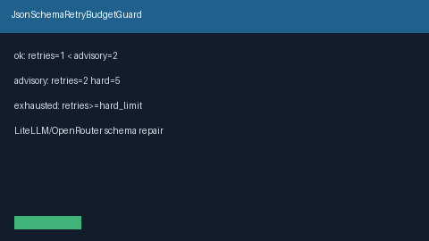

# JSON Schema Retry Budget Guard Guide

Per-request JSON schema repair retry budgets with `ok` / `advisory` /
`exhausted` bands — for GPT-5.5 / Claude Sonnet 4.6 / Gemini 3.x / Kimi K2
structured-output repair loops.



## Why

LiteLLM and OpenRouter expose structured-output repair retries in hosted
gateways. Nexus already has `OutputJsonSchemaGuard` for required-keys
post-checks. `JsonSchemaRetryBudgetGuard` tracks how many repair retries a
single `request_id` has consumed, with an advisory band and an optional hard
gate.

## Distinct from

| Component | Role |
| --- | --- |
| `OutputJsonSchemaGuard` | Post-check model JSON against required keys |
| `RetryBudgetAwareFailoverStrategy` | Provider failover routing under retry pressure |
| `JsonSchemaRetryBudgetGuard` | Per-`request_id` schema-repair retry counters |

## How it works

1. Construct with `advisory_limit` / `hard_limit` and optional `hard_gate`.
2. Call `record_retry(request_id)` after each repair attempt.
3. Inspect `band`, `remaining_hard`, `allow_retry`, or `assert_within_budget`.

Bands:

```text
exhausted  when retries >= hard_limit
advisory   when retries >= advisory_limit (and not exhausted)
ok         otherwise
```

## Example

```python
from safety.json_schema_retry import JsonSchemaRetryBudgetGuard

guard = JsonSchemaRetryBudgetGuard(advisory_limit=2, hard_limit=5, hard_gate=True)
snap = guard.record_retry("gpt-5.5-structured")
assert snap.band == "ok"
while guard.allow_retry("gpt-5.5-structured"):
    guard.record_retry("gpt-5.5-structured")
```

## Gap vs LiteLLM / OpenRouter

| Capability | LiteLLM / OpenRouter | Nexus |
| --- | --- | --- |
| Schema repair retry budget | Hosted / config | `JsonSchemaRetryBudgetGuard` |
| Advisory vs hard bands | Varies | Explicit `ok` / `advisory` / `exhausted` |
| Distinct from JSON validate | Often blended | Separate from `OutputJsonSchemaGuard` |
| Optional hard gate | Sometimes | `hard_gate` + `assert_within_budget` |
| Frontier model traffic | Yes | GPT-5.5 / Sonnet 4.6 / Gemini 3.x / Kimi K2 |
