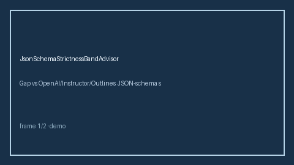

# JsonSchemaStrictnessBandAdvisor Guide



Offline HITL advisor. Never network I/O.

Gap vs OpenAI/Instructor/Outlines JSON-schema strictness advisors. Distinct from `JsonSchemaRetryAdvisor` and `OutputSchemaGuard`.

Optional polish via **GPT-5.5 / Claude Sonnet 4.6 / Gemini 3.x / Kimi K2**.

## Usage

```python
from safety.json_schema_strictness_band import JsonSchemaStrictnessBandAdvisor

advice = JsonSchemaStrictnessBandAdvisor().advise(request_id="r1", strictness_score=0.1)
print(advice.band)
```

## Safety

Advisory bands only. Humans decide routing actions.
