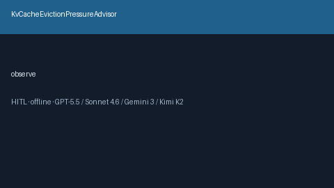

# KvCacheEvictionPressureAdvisor Guide



Offline HITL advisor. Never auto-acts. Closes gaps vs vLLM/TensorRT-LLM/SGLang KV-cache eviction pressure advisors.

Optional later polish via **GPT-5.5 / Claude Sonnet 4.6 / Gemini 3.x / Kimi K2**.

Distinct from `KvCacheHitRateAdvisor and PrefixCacheThrashAdvisor`.

## Usage

```python
from safety.kv_cache_eviction_pressure import KvCacheEvictionPressureAdvisor

advice = KvCacheEvictionPressureAdvisor().advise(request_id="r1", eviction_rate=0.125)
print(advice.band)
```

## Safety

No HTTP. Humans decide. See `SAFETY.md`.
