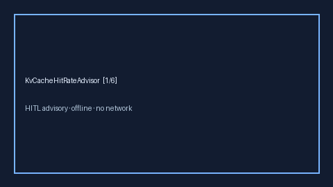

# KvCacheHitRateAdvisor Guide



Offline advisory KV-cache hit-rate bands. Closes vLLM / TensorRT-LLM /
OpenRouter cache-hit gaps.

Optional polish via **GPT-5.5 / Claude Sonnet 4.6 / Gemini 3.x / Kimi K2**.

Distinct from `PromptCacheHitAdvisor` and `PrefillTtftRatioAdvisor`.

## Usage

```python
from safety.kv_cache_hit_rate import KvCacheHitRateAdvisor

advice = KvCacheHitRateAdvisor().advise(request_id="r1", hit_rate=0.6, target_rate=0.8)
print(advice.band, advice.ratio)
```
