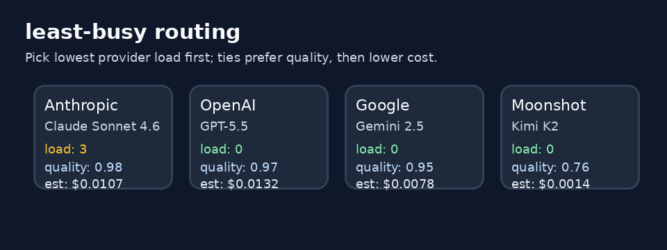

# Least-Busy Routing Guide

Use the `least-busy` strategy when you want quality-first routing that also
avoids sending fresh traffic to a provider that is already handling more live
requests than its peers.

## When to use it

- Traffic spikes can temporarily saturate one provider before latency/error
  signals catch up.
- You want requests spread across GPT-5.5, Claude Sonnet 4.6, Gemini 2.5, and
  Kimi K2 providers according to live load without giving up quality tie-breaks.
- You need deterministic, explainable choices from current router state rather
  than a random load-balancing arm.

## How it works

1. Filter to domain-eligible catalog candidates.
2. Read each candidate provider's current in-flight count from `InflightStats`.
3. Order candidates by provider load ascending.
4. Break equal-load ties by higher `quality_score`.
5. Break remaining ties by lower estimated request cost, then model name.

The router increments a provider's in-flight counter immediately before provider
dispatch and decrements it in cleanup after success, failure, or timeout. Cold
providers therefore start with load `0`, and completed attempts do not bias
future requests.

## Quick start

```bash
export NEXUS_DEFAULT_STRATEGY=least-busy
```

No additional `NEXUS_*` setting is required.

Or per request:

```http
X-Router-Strategy: least-busy
```

## Demo


