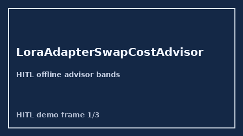

            # LoraAdapterSwapCostAdvisor Guide

            

            Closes vLLM / TensorRT-LLM / OpenRouter LoRA adapter swap cost gaps.

            Optional later polish via **GPT-5.5 / Claude Sonnet 4.6 / Gemini 3.x / Kimi K2**.

            Distinct from `PrefixCacheThrashAdvisor` and `ProviderColdStartLatencyAdvisor`.

            ## Usage

            ```python
            from safety.lora_adapter_swap_cost import LoraAdapterSwapCostAdvisor

advice = LoraAdapterSwapCostAdvisor().advise(request_id="r1", swap_ms=80.0)
print(advice.band)
            ```

            ## Safety

            Advisory only. No HTTP. Humans decide routing changes.
