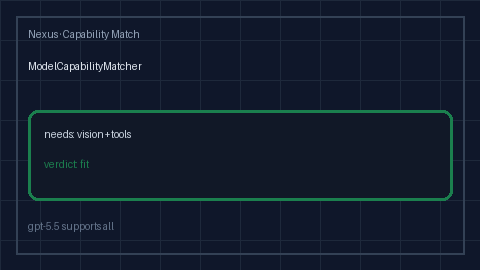

# Model Capability Matcher Guide

Match request needs (`vision` / `tools` / `json_schema` / `long_context`) to
model capability flags with `fit` / `partial` / `mismatch` verdicts for
GPT-5.5 / Claude Sonnet 4.6 / Gemini 3.x / Kimi K2.



## Why

OpenRouter, LiteLLM, and Portkey expose capability catalogs for routing, but
offline Nexus gateways still need a process-local matcher that compares
request needs to model flags without calling hosted APIs.
`ModelCapabilityMatcher` is advisory only: it never rejects traffic.

## Distinct from

| Component | Role |
| --- | --- |
| `ContextWindowFitAdvisor` | Token count vs **context limit** bands |
| `OutputJsonSchemaGuard` | Post-check JSON **required keys** |
| `ModelCapabilityMatcher` | Request **needs vs capability flags** |

## How it works

1. Construct with an optional `catalog` (`model_id -> capability flags`) and
   optional `known_capabilities` (defaults to vision/tools/json_schema/long_context).
2. `match(model=..., needs=[...], capabilities=...)` returns
   `CapabilityMatchAdvice`.
3. Verdicts:
   - `fit` when every required flag is supported (or needs are empty)
   - `partial` when some but not all required flags are supported
   - `mismatch` when none of the required flags are supported
4. Per-call `capabilities` overrides the catalog for that evaluation.

## Example

```python
from safety.capability_match import ModelCapabilityMatcher

matcher = ModelCapabilityMatcher(
    catalog={
        "gpt-5.5": {"vision", "tools", "json_schema", "long_context"},
        "claude-sonnet-4-6": {"tools", "json_schema", "long_context"},
        "gemini-3.x": {"vision", "long_context"},
        "kimi-k2": {"tools"},
    }
)

print(matcher.match(model="gpt-5.5", needs=["vision", "tools"]).verdict)  # fit
print(matcher.match(model="kimi-k2", needs=["vision"]).verdict)  # mismatch
```

## Gap vs OpenRouter / LiteLLM / Portkey

| Capability | OpenRouter / LiteLLM / Portkey | Nexus |
| --- | --- | --- |
| Capability catalogs | Hosted model metadata | Optional local catalog |
| Need vs flag match | Routing filters | `fit` / `partial` / `mismatch` |
| Distinct from context/schema | Often blended | Separate from context-fit / JSON guard |
| Offline / air-gapped | Requires SaaS metadata | In-process matcher |
| Frontier model traffic | Yes | GPT-5.5 / Sonnet 4.6 / Gemini 3.x / Kimi K2 |
