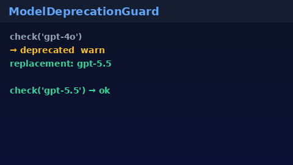

# Model Deprecation Guard Guide

Warn-or-block mapping from retired model aliases to current replacements for
GPT-5.5 / Claude Sonnet 4.6 / Gemini 3.x / Kimi K2 traffic.



## Why

Clients and stored configs often keep sending legacy IDs (`gpt-4o`,
`claude-3-5-sonnet`, `gemini-1.5-pro`, `moonshot-v1-128k`). LiteLLM and
OpenRouter maintain alias tables; offline Nexus gateways need a local
**safety** guard that returns a structured verdict before dispatch.

## Distinct from

| Component | Role |
| --- | --- |
| `router.model_ids` | Canonical *current* catalog constants |
| `ProviderModelListSync` / capability catalog | Refresh known-good capabilities |
| `ModelDeprecationGuard` | Retired alias → replacement + `warn`\|`block` |

## How it works

1. Construct `ModelDeprecationGuard()` (loads a small curated seed map).
2. Call `check(model_id)` → `DeprecationVerdict`.
3. When `is_deprecated` and `severity == "warn"`, log / rewrite to `replacement`.
4. When `severity == "block"`, reject before provider dispatch.
5. Extend at runtime with `register()` / `unregister()`.

## Example

```python
from safety.model_deprecation import ModelDeprecationGuard

guard = ModelDeprecationGuard()
verdict = guard.check("gpt-4o")
assert verdict.is_deprecated
assert verdict.replacement == "gpt-5.5"
assert verdict.severity == "warn"

guard.register("legacy-x", "kimi-k2", severity="block")
blocked = guard.check("legacy-x")
assert blocked.severity == "block"
```

## Seed map (curated, small)

| Deprecated | Replacement | Severity |
| --- | --- | --- |
| `gpt-4o` / `gpt-4o-mini` | `gpt-5.5` | warn |
| `claude-3-5-sonnet` (+ dated) | `claude-sonnet-4.6` | warn |
| `gemini-1.5-pro` | `gemini-3.1-pro-preview` | warn |
| `moonshot-v1-128k` | `kimi-k2` | warn |

## Gap vs LiteLLM / OpenRouter

| Capability | LiteLLM / OpenRouter | Nexus |
| --- | --- | --- |
| Alias / deprecation table | Yes (hosted) | `ModelDeprecationGuard` (local) |
| Warn vs block severity | Varies | Explicit `warn` \| `block` |
| Extensible register API | Config / dashboard | `register()` / `unregister()` |
| Frontier traffic | Yes | GPT-5.5 / Sonnet 4.6 / Gemini 3.x / Kimi K2 |
