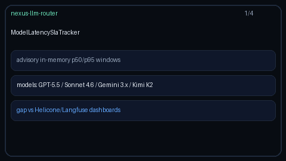

# Model Latency SLA Tracker Guide

Advisory in-memory per-model p50/p95 latency windows with SLA breach flags for
GPT-5.5 / Claude Sonnet 4.6 / Gemini 3.x / Kimi K2 — without an external
observability backend.



## Why

Helicone and Langfuse provide rich latency dashboards, but offline / air-gapped
Nexus gateways still need a process-local view of rolling percentiles and SLA
breaches. `ModelLatencySlaTracker` is advisory only: it never rejects traffic.
Callers record latencies and decide how to surface `breached` snapshots (logs,
metrics, operator alerts).

Distinct from the `latency-slo-shed` / `latency-budget` *routing strategies*,
which change model selection. This module is the reusable tracker library.

## How it works

1. Construct with `window_size` (default `100`) and `sla_p95_ms` (default
   `2000`), plus optional `per_model_sla_p95_ms` overrides.
2. `record(model, latency_ms)` appends into a bounded deque and returns a
   `LatencySlaSnapshot` with `p50_ms`, `p95_ms`, and `breached`.
3. `breaches()` lists every model whose current p95 exceeds its SLA.
4. `snapshot` / `models` / `clear` support introspection and tests.
5. An injectable `clock` keeps time-dependent extensions deterministic.

## Example

```python
from safety.latency_sla import ModelLatencySlaTracker

tracker = ModelLatencySlaTracker(
    window_size=100,
    sla_p95_ms=750.0,
    per_model_sla_p95_ms={"claude-sonnet-4-6": 1200.0},
)

tracker.record("gpt-5.5", 180.0)
tracker.record("claude-sonnet-4-6", 420.0)
tracker.record("gemini-3.5-flash", 90.0)
tracker.record("kimi-k2", 210.0)

for snap in tracker.breaches():
    print(snap.model, snap.p95_ms, snap.sla_p95_ms)
```

## Gap vs Helicone / Langfuse

| Capability | Helicone / Langfuse | Nexus |
| --- | --- | --- |
| Latency dashboards | Hosted UI | Process-local tracker |
| p50 / p95 windows | Yes | `LatencySlaSnapshot` |
| SLA breach flags | Alerting rules | Advisory `breached` |
| Offline / air-gapped | Requires SaaS/backend | In-memory, no network |
| Per-model thresholds | Yes | `per_model_sla_p95_ms` |
| Frontier model traffic | Yes | GPT-5.5 / Sonnet 4.6 / Gemini 3.x / Kimi K2 |
