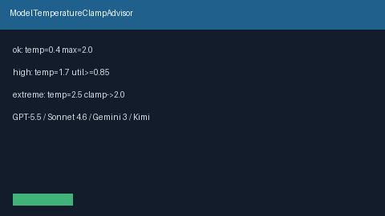

# Model Temperature Clamp Advisor Guide

Advisory temperature clamp bands (`ok` / `high` / `extreme`) from
`temperature` vs a policy `max_allowed` — for GPT-5.5 /
Claude Sonnet 4.6 / Gemini 3.x / Kimi K2 traffic **before** dispatch.



## Why

Operators need to know whether a requested sampling temperature fits a soft /
policy ceiling before dispatch. LiteLLM, OpenRouter, and Portkey expose
temperature limits in hosted UIs; Nexus needs an offline advisor that never
rejects traffic itself.

## How it works

1. Construct with optional `high_ratio` (default `0.85`, exclusive of `0`/`1`).
2. Call `advise(temperature=..., max_allowed=..., model=...)`.
3. Receive `TemperatureClampAdvice` with `band`, `suggested_clamp`
   (`min(temperature, max_allowed)`), and `advisory`.

Bands:

```text
extreme  when temperature > max_allowed
high     when utilization >= high_ratio (and not extreme)
ok       otherwise
```

## Example

```python
from safety.temperature_clamp import ModelTemperatureClampAdvisor

advisor = ModelTemperatureClampAdvisor(high_ratio=0.85)
advice = advisor.advise(
    temperature=1.7,
    max_allowed=2.0,
    model="gpt-5.5",
)
assert advice.band == "high"
print(advice.advisory, advice.suggested_clamp)
```

## Gap vs LiteLLM / OpenRouter / Portkey

| Capability | LiteLLM / OpenRouter / Portkey | Nexus |
| --- | --- | --- |
| Soft temperature ceiling | Hosted / config | `ModelTemperatureClampAdvisor` |
| Clamp bands | Varies | Explicit `ok` / `high` / `extreme` |
| Suggested clamp value | Varies | `suggested_clamp = min(temp, max)` |
| Kills requests | Sometimes | Never (advisory only) |
| Frontier model traffic | Yes | GPT-5.5 / Sonnet 4.6 / Gemini 3.x / Kimi K2 |
