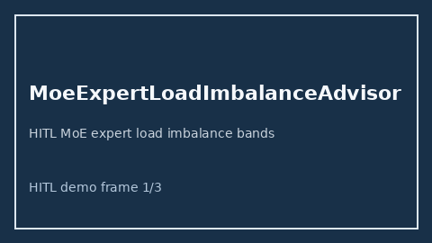

# MoeExpertLoadImbalanceAdvisor Guide



Offline HITL advisor. Never auto-acts. Closes gaps vs vLLM/TGI/SGLang MoE expert-load imbalance advisors.

Optional later polish via **GPT-5.5 / Claude Sonnet 4.6 / Gemini 3.x / Kimi K2**.

Distinct from ``ProviderExplorationEpsilonAdvisor`` and ``PrefillDecodeTokenSkewAdvisor``.

## Usage

```python
from safety.moe_expert_load_imbalance import MoeExpertLoadImbalanceAdvisor

advice = MoeExpertLoadImbalanceAdvisor().advise(request_id="r1", imbalance_ratio=0.3)
print(advice.band)
```

## Safety

No HTTP. Humans decide. See `SAFETY.md`.
