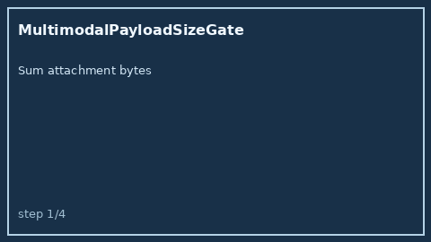

# MultimodalPayloadSizeGate Guide



Offline advisory control for LLM routing. Never performs network I/O.

Optional polish via **GPT-5.5 / Claude Sonnet 4.6 / Gemini 3.x / Kimi K2**.

## Usage

```python
from safety.multimodal_payload_size import MultimodalPayloadSizeGate

decision = MultimodalPayloadSizeGate().check(
    payload_bytes=2_000_000,
    max_bytes=5_000_000,
)
print(decision.band, decision.allowed)
```
