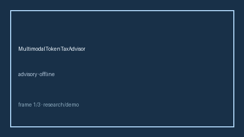

# MultimodalTokenTaxAdvisor Guide



Closes vLLM / OpenRouter / LiteLLM multimodal vision-token tax gaps.

Optional later polish via **GPT-5.5 / Claude Sonnet 4.6 / Gemini 3.x / Kimi K2**.

Distinct from `MultimodalPayloadSizeGate` and `OutputTokenCeilingGuard`.

## Usage

```python
from safety.multimodal_token_tax import MultimodalTokenTaxAdvisor

advice = MultimodalTokenTaxAdvisor().advise(request_id="r1", vision_tokens=800, text_tokens=200)
print(advice.band, advice.tax_ratio)
```

## Safety

Advisory only. No HTTP. Humans decide routing changes.
