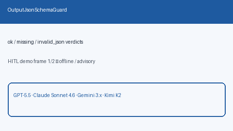

# Output JSON Schema Guard Guide

Post-completion validation of model JSON against a simple required-keys
schema — verdicts `ok` / `missing` / `invalid_json` for GPT-5.5 /
Claude Sonnet 4.6 / Gemini 3.x / Kimi K2 traffic.



## Why

Structured-output routing prefers models that *claim* JSON mode, but
completions can still omit keys or return non-JSON. LiteLLM / Portkey /
OpenRouter offer schema validation paths; Nexus needs a local post-check
guard that returns a structured verdict without touching PII or injection
controls.

## Distinct from

| Component | Role |
| --- | --- |
| `PromptInjectionGateway` | Pre-route injection allow / redact / block |
| PII redaction (`safety.pii`) | Sensitive-data scrubbing before dispatch |
| `structured-output-prefer` strategy | Prefers JSON-capable models |
| `OutputJsonSchemaGuard` | Post-check required-keys JSON verdict |

## How it works

1. Construct with `required_keys=["answer", "citations", ...]`.
2. Call `check(model_text)` on the completion string.
3. Branch on `verdict`:
   - `ok` — parsed object has every required key
   - `missing` — valid object but some keys absent (`missing_keys`)
   - `invalid_json` — not JSON, or JSON root is not an object

## Example

```python
from safety.output_schema_guard import OutputJsonSchemaGuard

guard = OutputJsonSchemaGuard(required_keys=["answer", "model"])
ok = guard.check('{"answer":"yes","model":"gpt-5.5"}')
assert ok.verdict == "ok"

missing = guard.check('{"answer":"yes"}')
assert missing.verdict == "missing"
assert missing.missing_keys == ["model"]

bad = guard.check("not json")
assert bad.verdict == "invalid_json"
```

## Gap vs LiteLLM / Portkey / OpenRouter

| Capability | LiteLLM / Portkey / OpenRouter | Nexus |
| --- | --- | --- |
| Post-check required keys | Yes (hosted / plugins) | `OutputJsonSchemaGuard` |
| Explicit verdict enum | Varies | `ok` / `missing` / `invalid_json` |
| Separate from injection / PII | Varies | Distinct safety modules |
| Frontier traffic | Yes | GPT-5.5 / Sonnet 4.6 / Gemini 3.x / Kimi K2 |
