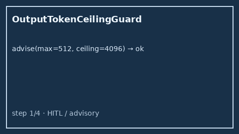

# Output Token Ceiling Guard Guide

Advisory output-token ceiling bands (`ok` / `near` / `over`) from
`requested_max_tokens` vs a policy ceiling — for GPT-5.5 /
Claude Sonnet 4.6 / Gemini 3.x / Kimi K2 traffic **before** dispatch.



## Why

Operators need to know whether a requested `max_tokens` fits a soft /
policy output ceiling before spending on a call that will be truncated or
rejected upstream. LiteLLM, OpenRouter, and Portkey expose ceilings in
hosted UIs; Nexus needs an offline advisor that never kills requests itself.

## Distinct from

| Component | Role |
| --- | --- |
| `StreamingTokenBudgetGate` | Hard mid-stream token/cost cut-off |
| `ContextWindowFitAdvisor` | Prompt tokens vs model **context** window |
| `OutputTokenCeilingGuard` | Requested **completion** max_tokens vs ceiling |

## How it works

1. Construct with optional `near_ratio` (default `0.85`, exclusive of `0`/`1`).
2. Call `advise(requested_max_tokens=..., ceiling=..., model=...)`.
3. Receive `OutputTokenCeilingAdvice` with `band`, `utilization`,
   `headroom_tokens`, and `advisory`.

Bands:

```text
over  when requested_max_tokens > ceiling
near  when utilization >= near_ratio (and not over)
ok    otherwise
```

## Example

```python
from safety.output_token_ceiling import OutputTokenCeilingGuard

guard = OutputTokenCeilingGuard(near_ratio=0.85)
advice = guard.advise(
    requested_max_tokens=3600,
    ceiling=4096,
    model="gpt-5.5",
)
assert advice.band == "near"
print(advice.advisory, advice.headroom_tokens)
```

## Gap vs LiteLLM / OpenRouter / Portkey

| Capability | LiteLLM / OpenRouter / Portkey | Nexus |
| --- | --- | --- |
| Soft max_tokens ceiling | Hosted / config | `OutputTokenCeilingGuard` |
| Ceiling bands | Varies | Explicit `ok` / `near` / `over` |
| Distinct from context fit | Often blended | Separate from `ContextWindowFitAdvisor` |
| Kills requests | Sometimes | Never (advisory only) |
