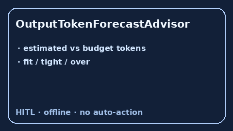

# OutputTokenForecastAdvisor Guide



Offline advisory output-token forecast bands. Closes OpenRouter / LiteLLM /
Portkey foresight gaps.

Optional polish via **GPT-5.5 / Claude Sonnet 4.6 / Gemini 3.x / Kimi K2**.

Distinct from `OutputTokenCeilingGuard` and `RequestCostForecastAdvisor`.

## Usage

```python
from safety.output_token_forecast import OutputTokenForecastAdvisor

advice = OutputTokenForecastAdvisor().advise(
    request_id="r1",
    estimated_tokens=900,
    budget_tokens=1000,
)
print(advice.band, advice.ratio)
```
