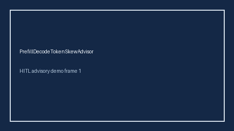

# PrefillDecodeTokenSkewAdvisor Guide



Offline HITL advisor. Never auto-acts. Closes gaps vs vLLM/SGLang/TensorRT-LLM prefill-vs-decode token-skew advisors.

Optional later polish via **GPT-5.5 / Claude Sonnet 4.6 / Gemini 3.x / Kimi K2**.

Distinct from ``PrefillTtftRatioAdvisor`` and ``SpeculativeDecodeBudgetAdvisor``.

## Usage

```python
from safety.prefill_decode_token_skew import PrefillDecodeTokenSkewAdvisor

advice = PrefillDecodeTokenSkewAdvisor().advise(request_id="r1", skew_ratio=3.5)
print(advice.band)
```

## Safety

No HTTP. Humans decide. See `SAFETY.md`.
