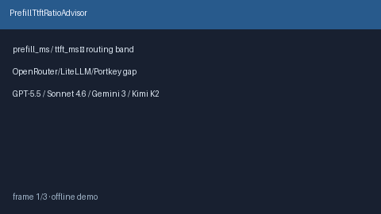

# PrefillTtftRatioAdvisor Guide



Offline advisory prefill/TTFT ratio bands. Never network I/O. Gap vs
OpenRouter / LiteLLM / Portkey prefill-heavy routing.

Optional polish via **GPT-5.5 / Claude Sonnet 4.6 / Gemini 3.x / Kimi K2**.

Distinct from `FirstTokenLatencySloAdvisor` and `ProviderColdStartLatencyAdvisor`.

## Usage

```python
from safety.prefill_ttft_ratio import PrefillTtftRatioAdvisor

advice = PrefillTtftRatioAdvisor().advise(
    provider="openai",
    prefill_ms=300.0,
    ttft_ms=400.0,
)
print(advice.band, advice.ratio)
```
