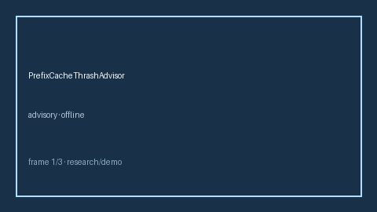

# PrefixCacheThrashAdvisor Guide



Closes vLLM / OpenRouter / LiteLLM prefix-cache thrash gaps.

Optional later polish via **GPT-5.5 / Claude Sonnet 4.6 / Gemini 3.x / Kimi K2**.

Distinct from `PromptCacheHitRateAdvisor` and `KvCacheHitRateAdvisor`.

## Usage

```python
from safety.prefix_cache_thrash import PrefixCacheThrashAdvisor

advice = PrefixCacheThrashAdvisor().advise(request_id="r1", evict_count=8, hit_count=10)
print(advice.band, advice.thrash_ratio)
```

## Safety

Advisory only. No HTTP. Humans decide routing changes.
