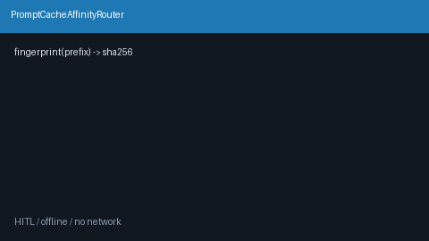

# Prompt Cache Affinity Guide

Sticky prompt-prefix fingerprint → preferred `model_id` table for provider
prompt-cache hits on GPT-5.5 / Claude Sonnet 4.6 / Gemini 3.x / Kimi K2.



## Why

Provider KV / prompt caches (OpenAI, Anthropic, Gemini, Moonshot) warm when
successive requests share a long identical prefix **on the same model**.
LiteLLM and OpenRouter expose cache-aware routing knobs, but offline Nexus
gateways still need a process-local remember/choose table after an observed
cache hit. `PromptCacheAffinityRouter` is that library.

**Distinct from:**

| Mechanism | Role |
| --- | --- |
| `prompt-prefix-cache` strategy | Deterministic hash of system prefix → catalog bucket |
| `cache-hit-sticky-warm-pool` | Consistent-hash sticky warm pool with health failover |
| `semantic-cache-ttl-affinity` | Semantic cache TTL affinity routing |
| `prompt-caching-prefer` | Prefer models that advertise prompt-caching capability |
| **This module** | Explicit remember/choose table callers wire after a cache hit |

This module is **not** registered in `RoutingStrategyName` / `build_strategies`.
Import it and compose around the engine.

## How it works

1. `fingerprint(prompt, chars=256)` → SHA-256 of the first N characters.
2. After a cache-friendly outcome, `remember(prefix_fingerprint, model_id)`.
3. On later turns, `choose(prefix_fingerprint, candidates)` returns the sticky
   model if it is still in `candidates`, else `None` (caller falls back).
4. `snapshot()` / `forget` / `clear` support introspection and eviction.

## Example

```python
from router.prompt_cache_affinity import PromptCacheAffinityRouter, fingerprint

affinity = PromptCacheAffinityRouter()
prompt = "system: shared tool schemas...\n" + user_turn
fp = fingerprint(prompt)

sticky = affinity.choose(fp, healthy_model_ids)
if sticky is not None:
    model_id = sticky
else:
    model_id = route_normally(...)  # your strategy / engine path

# After observing a provider cache hit (or first warm write):
affinity.remember(fp, model_id)
```

## Gap vs LiteLLM / OpenRouter

| Capability | LiteLLM / OpenRouter | Nexus |
| --- | --- | --- |
| Cache-aware model stickiness | Hosted / proxy knobs | Process-local affinity table |
| Explicit post-hit remember | App glue | `remember` / `choose` |
| Prefix fingerprint helper | Varies | `fingerprint(prompt, chars=N)` |
| Offline / air-gapped | Often SaaS-tied | In-memory, no network |
| Frontier model traffic | Yes | GPT-5.5 / Sonnet 4.6 / Gemini 3.x / Kimi K2 |
