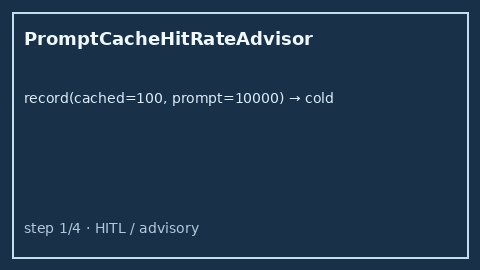

# Prompt Cache Hit Rate Advisor Guide

Advisory prompt-cache hit-rate bands (`cold` / `warm` / `hot`) from
`cached_tokens / prompt_tokens` — for GPT-5.5 / Claude Sonnet 4.6 /
Gemini 3.x / Kimi K2 traffic.



## Why

OpenRouter, LiteLLM, and Helicone surface prompt-cache hit metrics in hosted
UIs, but offline Nexus gateways still need a process-local advisor that
classifies hit rates into cold / warm / hot bands. `PromptCacheHitRateAdvisor`
never rejects traffic — callers log or alert on `band`.

## Distinct from

| Component | Role |
| --- | --- |
| `RequestFingerprintDeduper` | Identical-request content-hash duplicate window |
| `SemanticCacheStrategy` | Near-duplicate response routing / cache strategy |
| `PromptCacheHitRateAdvisor` | Advisory **cold / warm / hot** hit-rate bands only |

## How it works

1. Construct with `warm_min_hit_rate` (default `0.25`), `hot_min_hit_rate`
   (default `0.75`), and `window_size` (default `50`).
2. Call `record(cached_tokens=..., prompt_tokens=..., model=...)`.
3. Receive `PromptCacheHitAdvice` with `band`, `hit_rate`, `rolling_hit_rate`,
   and `advisory`.

Bands:

```text
hot   when hit_rate >= hot_min_hit_rate
warm  when hit_rate >= warm_min_hit_rate (and not hot)
cold  otherwise
```

## Example

```python
from safety.prompt_cache_hit import PromptCacheHitRateAdvisor

advisor = PromptCacheHitRateAdvisor(warm_min_hit_rate=0.25, hot_min_hit_rate=0.75)
advice = advisor.record(
    cached_tokens=8_000,
    prompt_tokens=10_000,
    model="gpt-5.5",
)
assert advice.band == "hot"
print(advice.advisory, advice.rolling_hit_rate)
```

## Gap vs OpenRouter / LiteLLM / Helicone

| Capability | OpenRouter / LiteLLM / Helicone | Nexus |
| --- | --- | --- |
| Prompt-cache hit UI | Hosted metrics | Process-local advisor |
| Hit-rate bands | Varies / dashboards | Explicit `cold` / `warm` / `hot` |
| Distinct from fingerprint / semantic cache | Often blended | Separate controls |
| Mutates / rejects | Sometimes | Never (advisory only) |
| Frontier model traffic | Yes | GPT-5.5 / Sonnet 4.6 / Gemini 3.x / Kimi K2 |
