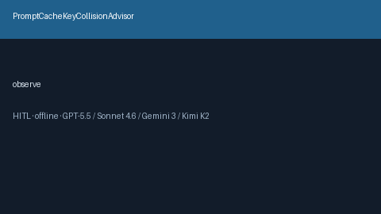

# PromptCacheKeyCollisionAdvisor Guide



Offline HITL advisor. Never auto-acts. Closes gaps vs vLLM/OpenRouter/LiteLLM prompt-cache key collision controls.

Optional later polish via **GPT-5.5 / Claude Sonnet 4.6 / Gemini 3.x / Kimi K2**.

Distinct from `PromptCacheHitRateAdvisor and PrefixCacheThrashAdvisor`.

## Usage

```python
from safety.prompt_cache_key_collision import PromptCacheKeyCollisionAdvisor

advice = PromptCacheKeyCollisionAdvisor().advise(request_id="r1", collision_rate=0.060000000000000005)
print(advice.band)
```

## Safety

No HTTP. Humans decide. See `SAFETY.md`.
