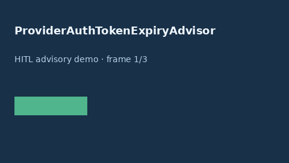

# ProviderAuthTokenExpiryAdvisor Guide



Offline HITL advisor. Never network I/O.

Gap vs OpenAI/Anthropic/Gemini provider auth-token expiry advisors. Distinct from ``ProviderQuotaRemainingAdvisor`` and ``VirtualKeysAdvisor``.

Optional polish via **GPT-5.5 / Claude Sonnet 4.6 / Gemini 3.x / Kimi K2**.

## Usage

```python
from safety.provider_auth_token_expiry import ProviderAuthTokenExpiryAdvisor

advice = ProviderAuthTokenExpiryAdvisor().advise(request_id="r1", minutes_to_expiry=120.0)
print(advice.band)
```

## Safety

Advisory only. Humans decide routing actions.
