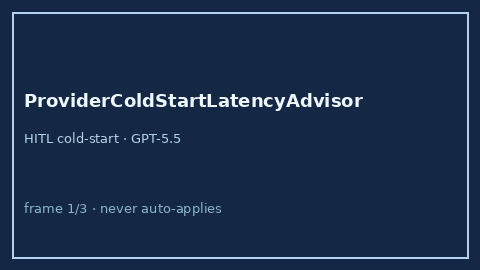

# ProviderColdStartLatencyAdvisor Guide



Offline advisory bands for provider cold-start latency. Never network I/O.
Closes OpenRouter / LiteLLM / Portkey cold-start routing gaps.

Optional later polish via **GPT-5.5 / Claude Sonnet 4.6 / Gemini 3.x / Kimi K2**.

Distinct from `FirstTokenLatencySloAdvisor` and `ProviderWarmPoolAdvisor`.

## Usage

```python
from safety.provider_cold_start_latency import ProviderColdStartLatencyAdvisor

advice = ProviderColdStartLatencyAdvisor().advise(
    provider="openai",
    cold_start_ms=800.0,
)
print(advice.band)
```
