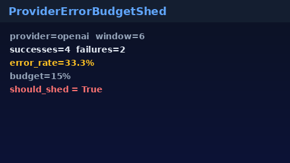

# Provider Error Budget Shed Guide

Sliding-window provider error-budget % shed for GPT-5.5 / Claude Sonnet 4.6 /
Gemini 3.x / Kimi K2 routing — reusable safety library for advisory or hard
pre-dispatch gates.



## Why

Circuit breakers trip on consecutive failures. Operators also need a **percent
error-budget** view: shed a provider when its rolling error rate exceeds a
budget (for example 15%) even if failures are interleaved with successes.
LiteLLM / OpenRouter expose similar reliability knobs; this module gives Nexus
an in-process, injectable implementation.

## Distinct from

| Component | Role |
| --- | --- |
| `CircuitBreakerRegistry` | Consecutive-failure open / recovery window |
| `provider-error-budget-shed` strategy | Routing strategy over engine `SuccessStats` |
| `provider-error-budget-reset` strategy | Timed-window reset stats in the engine |
| `ProviderErrorBudgetShed` (this module) | Owned sliding window + `should_shed` / hard gate |

## How it works

1. Construct with `window_size`, `error_budget_rate`, and optional `min_samples`.
2. Call `record_success(provider)` / `record_failure(provider)` after attempts.
3. `should_shed(provider)` is true when samples ≥ `min_samples` **and**
   `error_rate > error_budget_rate`.
4. Optional `hard_gate=True` makes `assert_within_budget` raise
   `ProviderErrorBudgetExceededError`.
5. Cold providers (no / few samples) never shed.

## Example

```python
from safety.provider_error_budget import (
    ProviderErrorBudgetExceededError,
    ProviderErrorBudgetShed,
)

shedder = ProviderErrorBudgetShed(
    window_size=100,
    error_budget_rate=0.15,
    min_samples=20,
    hard_gate=True,
)

shedder.record_success("openai")
shedder.record_failure("openai")

if shedder.should_shed("openai"):
    # soft: skip provider in candidate set
    ...

try:
    shedder.assert_within_budget("openai")
except ProviderErrorBudgetExceededError as exc:
    print(exc.snapshot.error_rate, exc.snapshot.shed)
```

## Related routing strategy

The `provider-error-budget-shed` strategy (`X-Router-Strategy` /
`NEXUS_DEFAULT_STRATEGY=provider-error-budget-shed`) applies a similar budget
using shared engine success stats. Prefer this **library** when you need an
owned sliding window outside the strategy registry (middleware, health probes,
or custom routers).

```bash
export NEXUS_DEFAULT_STRATEGY=provider-error-budget-shed
export NEXUS_PROVIDER_ERROR_BUDGET_RATE=0.15
```

## Gap vs LiteLLM / OpenRouter

| Capability | LiteLLM / OpenRouter | Nexus |
| --- | --- | --- |
| Error-budget % shed | Hosted / config | `ProviderErrorBudgetShed` |
| Sliding window ownership | Varies | In-process deque per provider |
| Advisory vs hard gate | Varies | `should_shed` / `hard_gate` |
| Distinct from circuit breaker | Often combined | Explicitly separate module |
