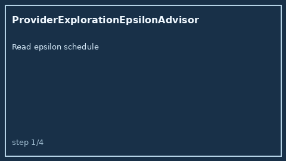

# ProviderExplorationEpsilonAdvisor Guide



Offline advisory control for LLM routing. Never performs network I/O.

Optional polish via **GPT-5.5 / Claude Sonnet 4.6 / Gemini 3.x / Kimi K2**.

## Usage

```python
from safety.provider_exploration_epsilon import ProviderExplorationEpsilonAdvisor

advice = ProviderExplorationEpsilonAdvisor().advise(epsilon=0.1, sample=0.05)
print(advice.band, advice.explore)
```
