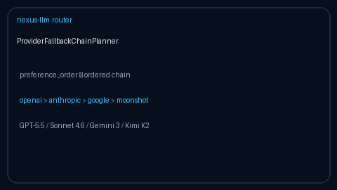

# Provider Fallback Chain Planner Guide

Deterministic ordered provider fallback chains from explicit preference lists —
for GPT-5.5 / Claude Sonnet 4.6 / Gemini 3.x / Kimi K2 traffic.



## Why

Operators often know a static preference order (for example OpenAI → Anthropic →
Google → Moonshot) and which providers are currently unavailable. LiteLLM and
OpenRouter expose health-ranked fallbacks; Nexus also needs an **offline
preference planner** that does not require live outcome stats.

`ProviderFallbackChainPlanner` never mutates state and never observes
latency/errors — it only orders candidates.

## Distinct from

| Component | Role |
| --- | --- |
| `ProviderFallbackScoreboard` | Outcome-based health ranking (`record_outcome` / `rank()`) |
| `ProviderFallbackChainPlanner` | Static preference order + unavailable skips |

## How it works

1. Construct with optional default `preference_order`.
2. Call `plan(candidates=..., unavailable=..., primary=...)`.
3. Receive `FallbackChainPlan` with `primary`, `chain`, `skipped_unavailable`,
   and `rationale`.
4. `ordered()` returns `[primary, *chain]` for dispatch loops.
5. Providers missing from preference order keep their input-relative order after
   known preferences.

## Example

```python
from safety.fallback_chain import ProviderFallbackChainPlanner

planner = ProviderFallbackChainPlanner(
    preference_order=("openai", "anthropic", "google", "moonshot"),
)
plan = planner.plan(
    candidates=("google", "openai", "moonshot", "anthropic"),
    unavailable={"anthropic"},
    # optional: primary="moonshot",
)
assert plan.primary == "openai"
assert plan.chain == ("google", "moonshot")
assert plan.ordered() == ["openai", "google", "moonshot"]
print(plan.rationale)
```

## Gap vs LiteLLM / OpenRouter

| Capability | LiteLLM / OpenRouter | Nexus |
| --- | --- | --- |
| Health-ranked fallbacks | Yes | `ProviderFallbackScoreboard` |
| Static preference chain planner | Limited / config YAML | `ProviderFallbackChainPlanner` |
| Offline / air-gapped | Often needs live stats | Pure function, no network |
| Frontier model traffic | Yes | GPT-5.5 / Sonnet 4.6 / Gemini 3.x / Kimi K2 |
