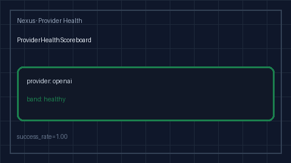

# Provider Health Scoreboard Guide

Advisory rolling success / error health bands (`healthy` / `degraded` /
`unhealthy`) per provider for GPT-5.5 / Claude Sonnet 4.6 / Gemini 3.x /
Kimi K2 traffic.



## Why

Portkey, Helicone, and LiteLLM surface provider health dashboards in hosted
UIs, but offline / air-gapped Nexus gateways still need a process-local
scoreboard that classifies rolling success and error rates into advisory
bands. `ProviderHealthScoreboard` never rejects traffic and never reorders
routes — callers log or alert on `band`.

## Distinct from

| Component | Role |
| --- | --- |
| `ProviderFallbackScoreboard` | EWMA score used to **rank** fallbacks in `NexusRouter` |
| `ProviderFallbackChainPlanner` | Static preference-order fallback chains |
| `FirstTokenLatencySloAdvisor` | TTFT / first-token SLO bands |
| `CircuitBreakerRegistry` | Consecutive-failure open / close |
| `ProviderHealthScoreboard` | Advisory **healthy / degraded / unhealthy** bands |

## How it works

1. Construct with `window_size` (default `100`),
   `healthy_min_success_rate` (default `0.95`),
   `degraded_min_success_rate` (default `0.80`), and `min_samples` (default `5`).
2. `record_success` / `record_failure` / `record_outcome` append into a
   bounded deque and return `ProviderHealthScoreAdvice`.
3. Bands (after `min_samples`):
   - `healthy` when `success_rate >= healthy_min_success_rate`
   - `degraded` when `success_rate >= degraded_min_success_rate`
   - `unhealthy` otherwise
4. Cold-start (`samples < min_samples`) stays `healthy`.
5. `scoreboard` / `unhealthy` / `snapshot` / `providers` / `clear` support ops.

## Example

```python
from safety.provider_health import ProviderHealthScoreboard

board = ProviderHealthScoreboard(
    healthy_min_success_rate=0.95,
    degraded_min_success_rate=0.80,
    min_samples=5,
)

board.record_success("openai")
board.record_failure("anthropic")
for snap in board.scoreboard():
    print(snap.provider, snap.band, snap.health_score, snap.advisory)
```

## Gap vs Portkey / Helicone / LiteLLM

| Capability | Portkey / Helicone / LiteLLM | Nexus |
| --- | --- | --- |
| Provider health UI | Hosted dashboards | Process-local scoreboard |
| Success / error bands | Alert rules | `healthy` / `degraded` / `unhealthy` |
| Distinct from fallback rank | Often blended | Separate from `ProviderFallbackScoreboard` |
| Offline / air-gapped | Requires SaaS | In-memory, no network |
| Frontier model traffic | Yes | GPT-5.5 / Sonnet 4.6 / Gemini 3.x / Kimi K2 |
