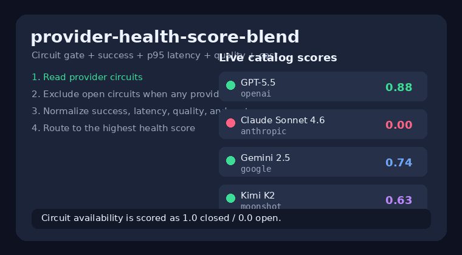

# Provider-Health Score Blend Routing Guide

Use the `provider-health-score-blend` strategy when you want LiteLLM- or
Portkey-style health-aware routing that optimizes quality, reliability, latency,
and cost at the same time.

## When to use it

- A provider can be soft-degraded before its circuit breaker fully trips.
- Open circuits should be skipped whenever another provider is available.
- You want a tunable score across GPT-5.5, Claude Sonnet 4.6, Gemini 3.x, and
  Kimi K2 without committing to pure quality, pure cost, or pure latency.
- Cold-start traffic should remain safe: missing success stats count as `1.0`,
  and missing p95 latency stats are normalized without divide-by-zero failures.

## How it works

1. Filter to domain-eligible catalog candidates, or the whole catalog if no model
   advertises the domain.
2. Read provider circuit availability (`1.0` for closed, `0.0` for open).
3. If at least one eligible provider is available, exclude open circuits from
   primary scoring. If every circuit is open, score all candidates so decide-time
   remains deterministic.
4. Score each candidate with normalized components:
   - provider success rate from `SuccessStats` (`1.0` when no data exists);
   - inverse normalized rolling provider p95 latency from `LatencyStats`;
   - model `quality_score`;
   - inverse normalized estimated request cost.
5. Select the highest score and order fallbacks by health first, then score.

## Quick start

```bash
export NEXUS_DEFAULT_STRATEGY=provider-health-score-blend
export NEXUS_HEALTH_BLEND_SUCCESS_WEIGHT=0.35
export NEXUS_HEALTH_BLEND_LATENCY_WEIGHT=0.25
export NEXUS_HEALTH_BLEND_QUALITY_WEIGHT=0.25
export NEXUS_HEALTH_BLEND_COST_WEIGHT=0.15
```

Or per request:

```http
X-Router-Strategy: provider-health-score-blend
```

Weights are normalized to sum to one, so only ratios matter. All-zero weights
fall back to pure quality.

## Demo


