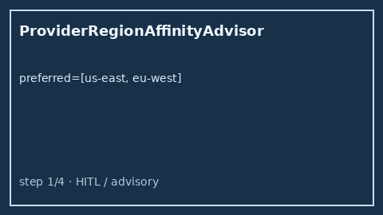

# Provider Region Affinity Advisor Guide

Rank providers by affinity to a preferred-region list — for GPT-5.5 /
Claude Sonnet 4.6 / Gemini 3.x / Kimi K2 traffic before dispatch.



## Why

OpenRouter, LiteLLM, and Portkey expose region / data-residency preferences in
hosted UIs. Offline Nexus gateways still need a process-local advisor that
scores providers against `preferred_regions` using a `provider → regions` map
and returns ranked advice. `ProviderRegionAffinityAdvisor` never rejects
traffic — callers reorder or log from `rankings`.

## Distinct from

| Component | Role |
| --- | --- |
| `ProviderHealthScoreboard` | Rolling success/error **health** bands |
| `StickyProviderAffinity` | Session_key → provider sticky map |
| `ProviderRegionAffinityAdvisor` | Ranked **region affinity** advice only |

## How it works

1. Construct `ProviderRegionAffinityAdvisor()` (stateless).
2. Call `advise(preferred_regions=[...], provider_regions={...})`.
3. Receive `RegionAffinityAdvice` with 1-based `rankings` ordered by
   `affinity_score` (ties break by provider id).

Scoring:

```text
+1.0   if provider covers the first preferred region
+0.5/(n-1) per additional preferred-region overlap (n = len(preferred))
 0.0   if no overlap (still ranked last)
```

## Example

```python
from safety.region_affinity import ProviderRegionAffinityAdvisor

advisor = ProviderRegionAffinityAdvisor()
advice = advisor.advise(
    preferred_regions=["us-east", "eu-west"],
    provider_regions={
        "openai": ["us-east", "us-west"],
        "anthropic": ["eu-west"],
        "moonshot": ["ap-southeast"],
    },
)
assert advice.rankings[0].provider == "openai"
print(advice.advisory)
for row in advice.rankings:
    print(row.rank, row.provider, row.affinity_score, row.advisory)
```

## Gap vs OpenRouter / LiteLLM / Portkey

| Capability | OpenRouter / LiteLLM / Portkey | Nexus |
| --- | --- | --- |
| Region / residency preference | Hosted routing prefs | Process-local advisor |
| Ranked affinity scores | Varies | Explicit `affinity_score` + ranks |
| Distinct from health / sticky | Often blended | Separate controls |
| Mutates / rejects | Sometimes | Never (advisory only) |
| Frontier model traffic | Yes | GPT-5.5 / Sonnet 4.6 / Gemini 3.x / Kimi K2 |
